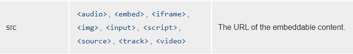
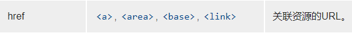

# 数据链接

也叫做 data url。见实例.html(用的很少，但是可能会遇到)

## 如何书写

原本：``，会将路径中的文件数据读取出来，将数据当成图片显示到页面上

数据链接：将目标文件的数据直接书写到路径位置(不光是图片，其他凡是可以写 url 地址的地方都可以使用 data url。见实例 1.html)

语法(具体的书写方式)：data:MIME,相关数据

css 文件、js 文件也都可以使用这种方式(一般不用 data url 的形式)

```html
<link rel="stylesheet" href="data:text/css,h1{color:red}" />
```

## 意义

优点：1. 减少了浏览器中的请求

请求：浏览器在访问网站例：淘宝的时候，得到的页面都不是在我们的电脑上的，而是在淘宝的服务器上的(从我的页面发出一个消息到淘宝的服务器，让他把相应页面给我)

响应：相对于服务器的。服务端把这个请求的网页给客户端

较少了请求中浪费的时间

2. 有利于动态生成数据(数据可以不写死，可以变化的。)

缺点：

1. 增加了资源的体积

导致了传输内容增加，从而增加了单个资源的传输时间

2. 不利于浏览器的缓存

浏览器通常会缓存图片文件、css 文件、js 文件，而 data url 不会缓存

3. 会增加原资源的体积到原来的 4/3（与 base64 的编码方式有关）

应用场景：

1. 但请求单个图片体积较小，并且该图片因为各种原因，不适合制作雪碧图(雪碧图也可以减少文件)，可以使用数据链接。（现阶段用不到）

2. 图片由其他代码动态生成，并且图片较小，可以使用数据链接

```css
div {
  width: 400px;
  height: 400px;
  background: url("data:image/png;base64,iVBOR...");
}
```

## base64

一种编码（将数据从一种形态变成另一种形态）方式

通常用于将一些二进制数据，用一个可书写的字符串表示

可以百度一下，将相关数据编码解码

```html
<link rel="stylesheet" href="data:text/css;base64,aDF7Y29sb3I6cmVkfQ==" />
```

## 补充：关于 src(同步) 和 href(异步)

src 用于替换当前元素，href 用于在当前文档和引用资源之间确立联系。

1. src 是 source 的缩写，指向外部资源的位置，指向的内容将会嵌入到文档中当前标签所在位置；在请求 src 资源时会将其指向的资源下载并应用到文档内，例如 js 脚本，img 图片和 frame 等元素。

`<script src ="js.js"></script>`

当浏览器解析到该元素时，会暂停其他资源的下载和处理，直到将该资源加载、编译、执行完毕，图片和框架等元素也如此，类似于将所指向资源嵌入当前标签内。这也是为什么将 js 脚本放在底部而不是头部。


2. href 是 Hypertext Reference 的缩写，指向网络资源所在位置，建立和当前元素（锚点）或当前文档（链接）之间的链接，如果我们在文档中添加

`<link href="common.css" rel="stylesheet"/>`
那么浏览器会识别该文档为 css 文件，就会并行下载资源并且不会停止对当前文档的处理。这也是为什么建议使用 link 方式来加载 css，而不是使用@import 方式。


