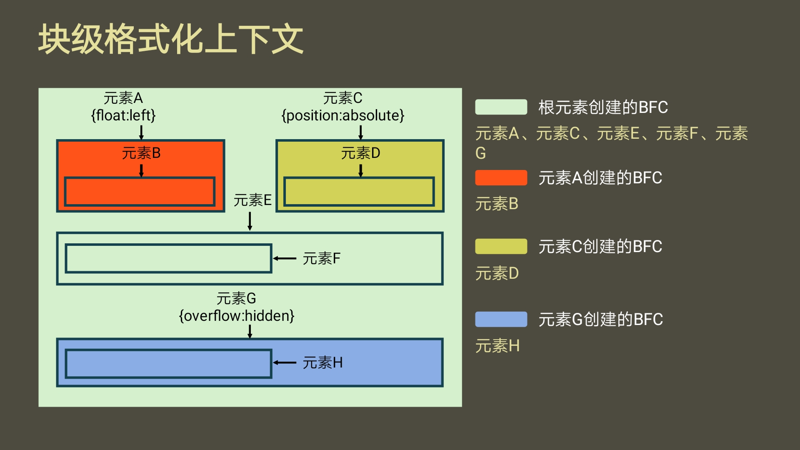

# 块级格式化上下文

全称Block Formatting Context,简称BFC

他是一块独立的渲染区域，规定了在该区域中，常规流块盒的布局。

- 它规定了在该区域中，常规流块盒的布局

1. 常规流块盒在水平方向上必须撑满包含块
2. 常规流块盒在垂直方向上依次摆放
3. 常规流块盒若外边距无缝相连，则进行外边距margin合并

- BFC渲染区域

这个区域由某个HTML元素创建，以下元素会在其内部创建BFC区域：

1. 根元素：意味着<html>元素创建的BFC区域，覆盖了网页中所有的元素
2. 浮动和绝对、固定定位元素
3. overflow不等于visiable的块盒

> overflow属性值有：hidden、auto、scroll、visiable

- 独立的

不同的BFC区域，渲染时互不干扰；创建BFC的元素，隔绝了它内部和外部的联系，内部的渲染不会影响到外部；具体规则如下：

1. 创建BFC的元素，它的自动高度需要计算浮动元素
2. 创建BFC的元素，它的边框盒不会与浮动元素重叠
3. 创建BFC的元素，不会和它的子元素进行外边距合并

> 绝对定位、固定定位会会完全脱离文档流，所以自动高度一定不会计算他们在内

浮动的块虽然脱离的正常的文档流，但是还会占有正常文档流的文本空间  ;  float只是脱离了文档流的dom空间但是还占据着文字空间   -----from  CSDN