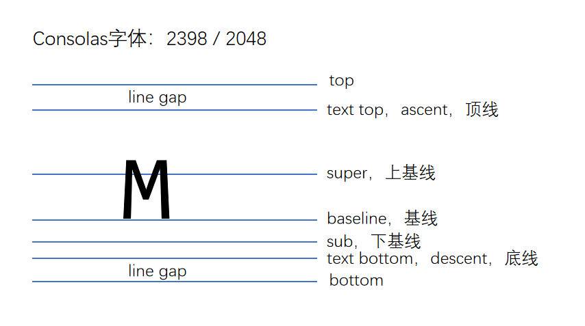
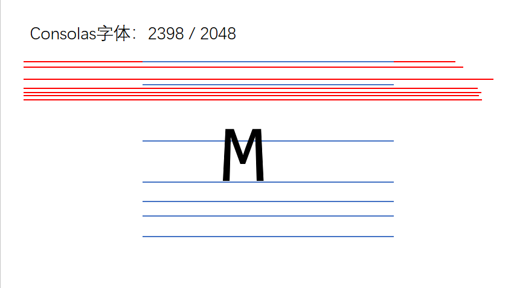

# 参考线-深入理解字体

设计 css 属性：font-size、line-height、vertical-align、font-family

## 文字

文字是通过一些文字制作软件制作的，比如 fontforge

制作文字时，会有几根参考线(这些线主要起到一个文字对齐的作用)，不同的文字类型，参考线不一样。同一种文字类型，参考线一致

## 关于 font-size

字体大小，设置的是文字的相对大小

每个文字除了参考线外还有文字的相对大小：1000、2048、1024

在印刷学里面文字的相对大小有：1000、2048、1024(没有什么单位，指的是金属框的尺寸)

文字顶线 text top 到底线 text bottom 的距离，是文字的实际大小(content-area 内容区)。实际内容区只能根据文字相对大小来定。

文字的实际大小比文字的相对大小大。例如相对大小 2048 和实际大小 2398 。看图：

行盒的背景覆盖 content-area

## 行高

顶线向上延申的空间，和底线向下延申的空间，两个空间相等。该空间叫做 gap(空隙)

gap 默认情况下，是字体设计者决定的。可正可负

将 top 到 bottom(看 ppt 图)，叫做 virtual-area(虚拟区)。这个区域是可以调节的。

行高，就是 virtual-area。即文字大小是确定的。行高实际上设置的是 line gap 的距离。

line-height:normal，默认值，使用文字默认的 gap(即字体设计者决定的)。每个浏览器算法都不一致。

> 问题：文字一定出现一行的最中间--错误的，文字出现在那有文字设计者决定

> 文字：文字的实际大小 content-area 一定出现再 virtual-area 中间--正确的，因为 line gap 是一致的

若想要多行文本之间空隙最小，设置 line-height 为 normal 是最好的选择，由于字体不同，想要多行间完全没有空隙是做不到的。

## vertical-align

决定参考线的属性：font-size、font-family、line-height

文字一定会在参考线里面的原因：只有行盒才有参考线。所以即便不是行盒包裹文字也一定有匿名行盒的出现来包裹文字。

一个元素如果子元素出现行盒，该元素也会产生参考线。排列如图：

默认情况下，基线对齐。即 vertical-align 默认值为 baseline

baseline：该元素的基线与父元素的基线对齐

super：该元素的基线与父元素的上基线对齐

sub：该元素的基线与父元素的下基线对齐

text-top：该元素的 virtual-area 的顶边 top，对齐父元素的 text-top

text-bottom：该元素的 virtual-area 的底边 bottom，对齐父元素的 text-bottom

top：该元素的 virtual-area 的顶边，对齐父元素的顶边 line-box (该行的最高顶边)

bottom：该元素的 virtual-area 的底边，对齐 line-box 的底边

middle：该元素的中线(content-area 的一半)，与父元素的 X 字母高度一半的位置对齐

行盒组合起来，可以形成多行；每一行的区域叫做 line-box，line-box 的顶边是该行内所有行盒最高顶边，底边是该行行盒的最低底边。

实际，一个元素的实际占用高度(高度自动)。高度是通过 line-box 计算的。

行盒：inline-box
行框：line-box

数值：相对于基线的偏移量，向上为正数，向下为负数

百分比：相对于基线的偏移量，百分比是相对于自身 virtual-area 的高度

line-box 是承载文字内容的必要条件，以下情况不生成行框：

1. 某元素内部没有任何行盒

2. 某元素字体大小为 0

## 可替换元素和行块盒的基线

图片：基线位置位于图片的下外边距。div>img 使用 virtical-align 不好解决

表单元素：基线位置在内容底边

行块盒：

1. 行块盒最后一行有 line-box，用最后一行的基线作为整个行块盒的基线

2. 如果行块盒内部/最后一行没有行盒/文字，则使用下外边距作为基线

本节课了解即可。
