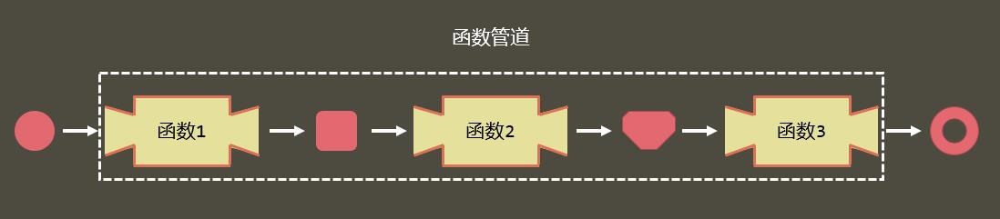

# 函数管道pipe

函数管道理念：将多个单参函数组合起来，形成一个新的函数；这些函数中，前一个函数的返回值(输出)为后一个函数的参数(输入)。（前提：单参函数）也是函数式编程的常见思想



```js
//实现：将一个字符串变为小驼峰命名法。将以上写好的函数组合起来
// str = everyFirstLetterUp(str);
// str = firstLetterLower(str);
// str = otherLetterLower(str);
// str = removeEmpty(str);
// console.log(str); //反复调用，麻烦；难以维护且容易出错
// //这些函数都只有一个参数。且前一个的返回值为下一个函数的参数。怎么用？
var smallCamel = myPlugin.pipe(
  everyFirstLetterUp,
  firstLetterLower,
  otherLetterLower,
  removeEmpty,
  myPlugin.curry(curString, 10) //这个就是单参函数了。前提是number参数放在前面
); //将这些函数组合形成一个新的函数。函数调用顺序固定下来了，复杂度降低
console.log(smallCamel(str));
```

```js
/**
 * 函数管道：参数为多个单参函数
 */
this.myPlugin.pipe = function () {
  var args = Array.from(arguments); //拿到函数的所有实参
  return function (val) {
    // args.forEach((item) => {
    //   val = item(val);
    // });
    // return val;
    return args.reduce(function (result, func) {
      return func(result);
    }, val); //val是result的默认值
  };
};
```