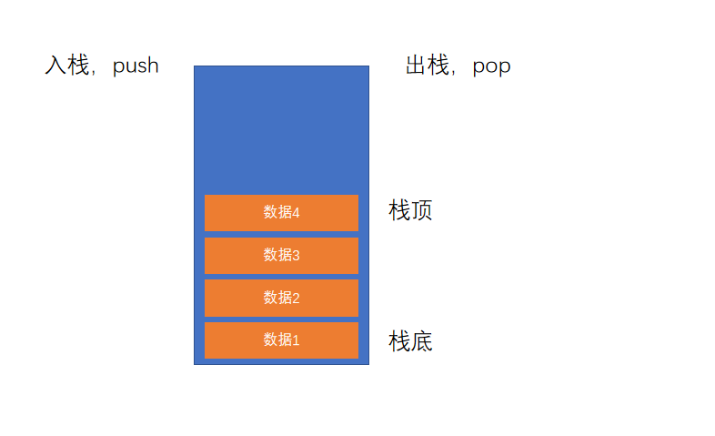

# 执行上下文

本节课是进阶部分最重要的知识点，帮助你理解整个程序的执行

执行上下文：一个函数运行即被调用之前，创建的一块内存空间，空间中包含有该函数执行所需要的数据，为该函数的执行提供支持
    - 也可以理解为函数上下文

执行上下文栈：call stack，是栈的一种，所以符合栈的规则；不过它特殊在是所有执行上下文组成的内存空间
    - 栈的空间是有限的。如果不断地重复调用。栈溢出会报错

栈：是一种数据结构，先进后出，后进先出
    - 入栈push：在栈的内存空间中加入一个数据
    - 出栈pop：在栈的内存空间中移除一个数据
    - 栈顶：栈的最顶部。即最新添加的数据
    - 栈底：栈的最底部。即最先添加的数据



全局执行上下文：所有的 js 代码执行之前，都必须有该环境。因为所有代码的起始位置都是全局环境

js 引擎始终执行的是栈顶的执行上下文

```js
console.log("G1"); //3. 调用函数。创建执行上下文。函数调用完该执行上下文出栈
function A() {
  console.log("A1"); //5. 调用函数。...
  function B() {
    console.log("B"); //7. 调用函数。...
  }
  B(); //6. 调用函数。...
  console.log("A2"); //8. 调用函数
}
A(); //4.调用函数A。创建执行上下文环境
console.log("G2"); //9. 调用函数。....。最终全局执行上下文出栈
//G1 A1 B A2 G2
//浏览器执行代码时，虽然js是解释型语言。但浏览器会先扫一眼代码
//任何js代码运行都会有一个环境即执行上下文。一开始看到全局代码在全局执行上下文中
//1. 先建立全局执行上下文。开始执行js代码
//2. 每次调用函数，都会创建一个新的函数上下文（js引擎始终执行的是栈顶的上下文）
```

## 执行上下文中的内容

执行上下文中的内容，即执行上下文里面装了什么东西：this指向和VO变量对象

函数运行前创建执行上下文，有了执行上下文才能执行函数；执行上下文决定this指向

> 调用函数的时候即创建好执行上下文后，this指向才被确定下来

1. this 指向
    - 直接调用函数，this 指向全局对象
    - 在函数外，this 指向全局对象
    - 通过对象调用或 new 一个函数，this 指向调用的对象或新对象


```js
console.log(this.name); //2. ""
function A() {
  this.abc = 123;

  function B() {
    console.log(this); //5. window对象
  }
  B(); //4. this指向window对象
}
var a = new A(); //3.函数A的上下文。要做很多事情：this指向是在调用函数的时候确定的，等this指向新对象

console.log(a.abc); //6. 123
//1. 全局上下文，可以认为他就是一个对象，存放地址指向一块内存空间，里面有this指向(遵循规则)和VO
//这些对象实际上存在于堆里面。栈里面只是存放了这些对象的地址
```

2. VO 变量对象！

全称Variable Object：变量对象VO 中记录了该环境中所有声明的参数、变量和函数

Global Object：GO，全局执行上下文中的 VO也叫GO。
    - 里面有声明的变量、函数、参数；
    - 全局对象里所有的属性都是GO里面的内容
    - this指向window对象
    - 之所以在全局环境中能直接使用console.log等，是因为GO里面有全局对象的属性

Active Object：AO，当前正在执行的上下文中的VO。

确定变量的顺序：(变量对象VO里面有哪些东西)
1. 确定所有形参值以及特殊变量 函数中的伪数组arguments（实参列表）
2. 确定函数中通过 var 声明的变量，将他们的值设置为 undefined，如果 VO 中已有该名称，则直接忽略
   1. 即var声明的变量若和形参冲突，则忽略var声明的变量
3. 确定函数中通过字面量声明的函数，将他们的值设置为指向函数对象，如果 VO 中已存在该名称，则覆盖(函数覆盖，变量忽略)
   1. 即函数是一等公民
   2. 字面量声明函数，一旦提取到VO里面；之后不再看他因为已经处理过了
   3. 确定上下文时，此规则是不会因为return或if而改变的

> 当一个上下文中的代码执行的时候，如果上下文中不存在某个属性，则会从之前的上下文(即外部环境)中寻找
> 函数里面可以用外部环境的东西就是基于这个原理
