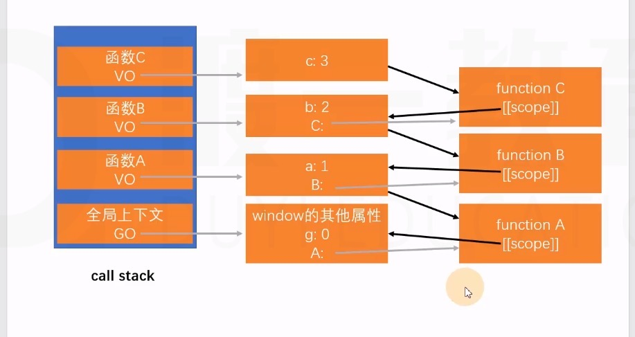

# 作用域链(解释一个闭包现象 )

1. VO (函数调用产生)中包含一个额外的属性，该属性指向创建该 VO 的函数本身

2. 每个函数在创建/定义/声明时，会有一个隐藏属性`[[scope]]`，它指向创建该函数时的 AO

3. 当访问一个变量时，会先查找自身 VO 是否存在，如果不存在，则依次查找`[[scope]]`属性

某些浏览器会优化作用域链，函数的`[[scope]]`中仅保留需要用到的数据

> 创建函数时形成闭包，而非调用时！(若形成闭包，寻找数据时，找到函数定义时的数据)

```js
var g = 0;
function A() {
  var a = 1;
  function B() {
    var b = 2;
    var C = function () {
      var c = 3;
      console.log(c, b, a, g);
    };
    C();
  }
  B();
}
A();
```


