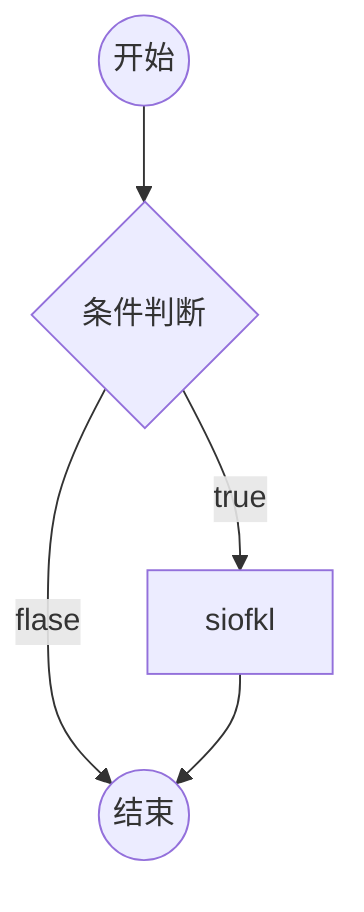
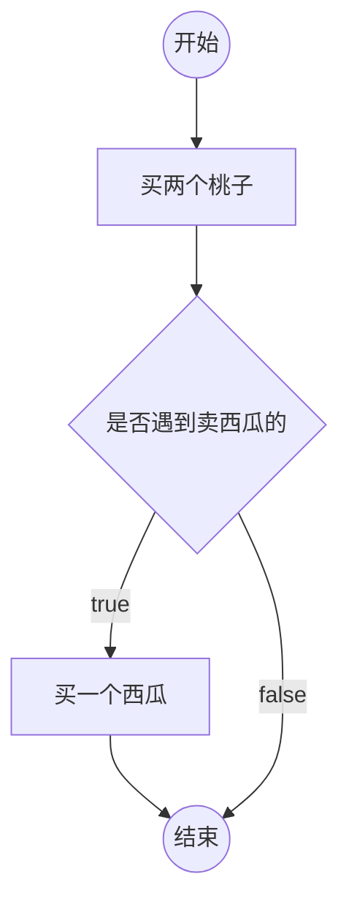
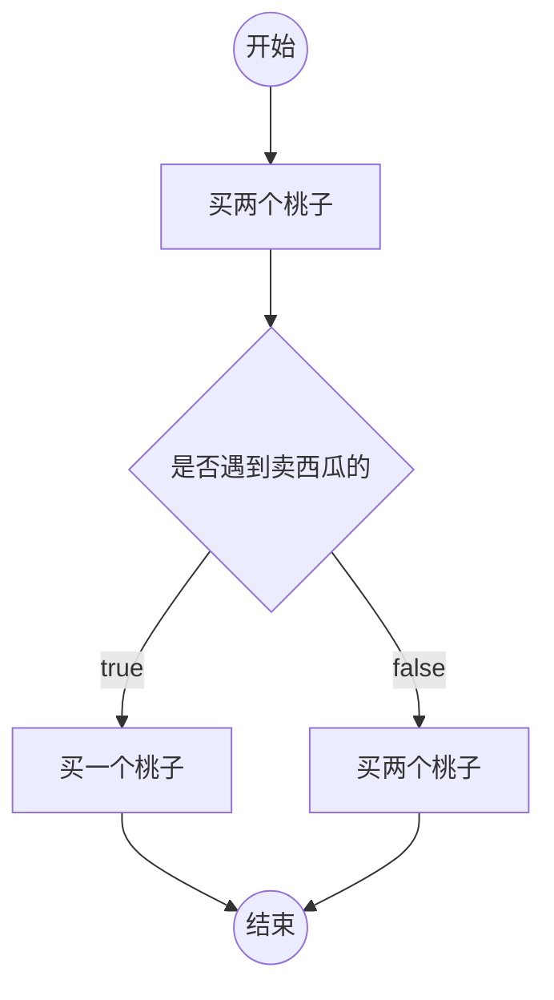
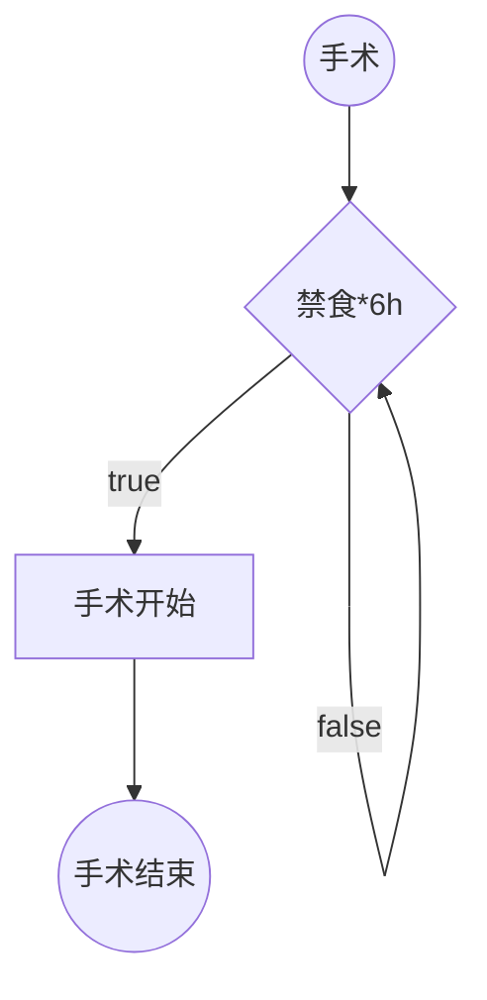

# 流程图(在markdown中画流程图)

本章学习基础部分很重要的流程控制。执行一堆语句。开始有难度。逻辑思维需要不断的练习，练习出来的。

逻辑思维的提高：通过不断地练习

流程图：一套标准的图形，用于描述程序的逻辑

通常用流程图来分析程序的流程。画流程图的工具有很多，现在在markdown中也可以画流程图

以下图片是流程图中规定的标准图形

> markdown中粘贴图片，用ctrl+alt+v

## 在markdown中画流程图

markdown 中的mermaid语法

### 例子

1. 思维一

2. 思维二

3. 练习---from me
