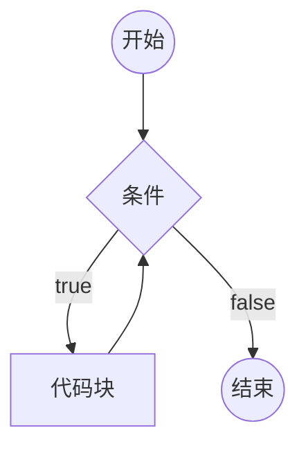
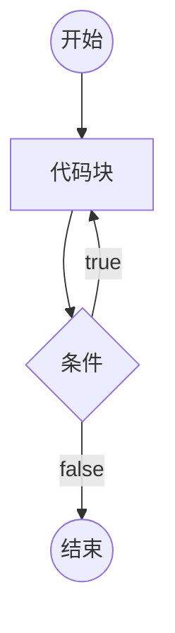
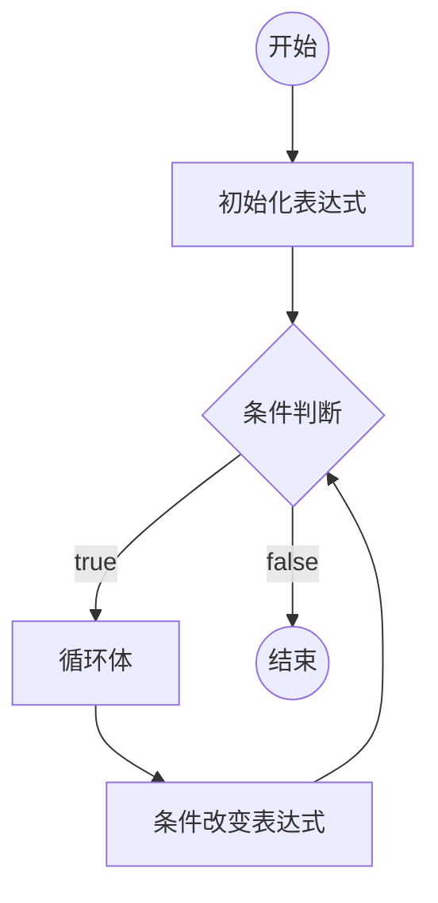

# 循环

重复的运行一段代码

js支持三种循环结构（目前就js5而言）：while循环、do while循环、for循环

## while循环

```js
while(条件){
    代码块(循环体);
}
```



> 死循环：条件永远满足，永远无法退出循环

## do-while循环

```js
do{
    循环体
}while(条件);
```



## for循环

```js
for(初始化表达式;条件;条件改变表达式){
    循环体;
}
```



## 循环中的关键字

循环控制语句

- break：跳出循环
- continue：停止当前循环体，进入下一次循环