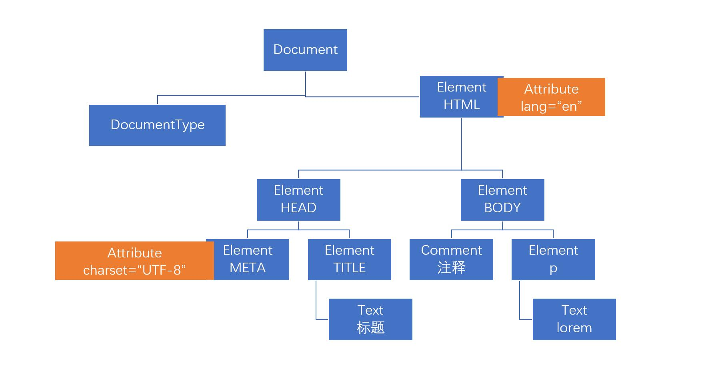

# web api 概述

前六章非常重要，学习的是ES语言标准，在任意环境下都使用。js语法规则都已经学完，还有一部分细节见进阶部分

后续我们需要进行浏览器宿主环境的学习。

标准库：学习的是ECMAScript 中提供的对象和函数。在任何环境下都可以使用

- 库：liberary，侧重表示里面存放很多东西
- API：应用程序编程接口，Application Programing Interface，侧重表示使用层面的东西
- 标准：ECMAScript 标准

web api：学习的是浏览器宿主环境中提供的对象和函数。即互联网提供的知识

web api的学习特点：
1. 知识繁杂，但是没有必要全部学完
2. ！是成体系的知识，类似于Date构造器，需要掌握一些逻辑上的概念。web api重点学习的就是这部分
3. ！涉及到程序思维：知识 + 程序思维 = 应用（怎么将学习的东西做出来效果。这门课学完可以做出来非常丰富的效果）多练！才行
4. 兼容性：在不同浏览器或同一个浏览器的不同版本里面的不同。了解，不记忆

> 之后真正的开发过程中，不太会使用原生JS（现在学的东西）来书写代码，因为后面会使用一些框架、第三方库等，这些都会帮助你解决兼容性问题

Web Api是一套对象和函数，分为两个部分：
- BOM：Browser Object Model，浏览器对象模型，是用于控制浏览器本身（得到浏览器网页尺寸、alert等）
- DOM：Document Object Model，文档对象模型，是控制 的HTML 文档（网页里面的元素、注释等，即网页上有什么东西），重点学习Dom啦

ES 语言标准是由 ECMAScript 规定的。
web Api接口标准是由 w3c(万维网联盟)制定。查文档即找字典一般用MDN

## 关于DOM的发展阶段

- DOM 0：是一种历史性的说法
- DOM 1：
- DOM 2
- DOM 3
- DOM 4，2015 年发布。同年发布了ES6

**DOM 是什么？**

DOM 的核心理念，是将一个HTML或XML文档（两种格式的文档都支持，我们接触的是html），用对象模型表示，每个对象称之为dom对象。（即将文档看作是一个对象模型，对象模型是将各种对象形成一种结构联系起来）

dom 对象又称之为dom节点 node。这个概念延用了xml的概念

XML也是一种文档模式，这种模式便于计算机和人理解我们的文档内容。特点是没有要求节点的名称是什么，节点必须要有结束标记或者自结束

```xml
<User>
<name>YU</name>
<age>26</age>
<gender>男</gender>

</User>
```

## 节点的类型

- DocumentType：是指文档类型节点。```<!DOCTYPE html>```
- Document：是指文档节点，表示整个文档。可以想象成有一个不存在的元素将整个文档包起来
- Comment：是指注释节点```<!--注释-->```
- Element：是指元素节点，是学习的重点```<div></div>```
- Text：是指文本节点。哪怕是回车都是文本节点
- Attribute：是指属性节点。```charset="UTF-8"```
- DocumentFragment：是指文档片段节点。现在看不到，之后在做一些操作的时候可能会看到

## dom 树

dom树是指：文档中不同的节点形成的树形结构


