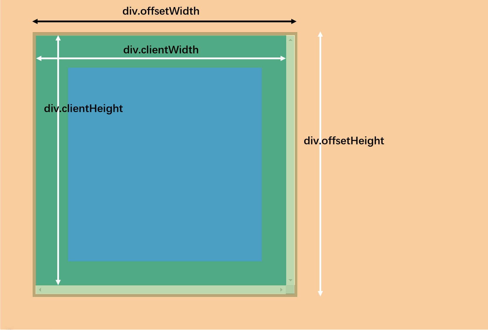

# 其他事件

- unload、beforeunload(先于 unload 发生)都不常用
  - beforeunload：window 的事件，在关闭窗口时运行，理论上可以阻止关闭窗口但谷歌浏览器该事件无效（发送网络请求时可以使用该事件告诉服务器）
  - unload：window 的事件，关闭窗口时运行，不可以阻止关闭窗口

```js
window.onbeforeunload = function () {
  return "该网页正在运行重要内容，关闭网页可能会损坏您的计算机，确认离开此页吗?"; //阻止关闭窗口，IE才有
};
```

- scroll：窗口发生滚动时运行的事件(元素上也会有 scroll 事件)
  - 
  - 实际的内容即全部的内容，元素区域即只能显示该区域面积的内容
  - 想要知道滚动了多少通过 scrollTop 和 scrollLeft，可以获取和设置元素上的滚动距离
  - window 上的滚动距离(存在兼容性问题，因此使用)：`document.documentElement.scrollTop + document.body.scrollTop`

```js
var p = document.querySelector("p");
p.onscroll = function () {
  // console.log("p元素滚动");
  console.log(this.scrollLeft, this.scrollTop);
  console.log(this.clientWidth,this.clientHeight)
  console.log(this.offsetWidth,this.offsetHeight)
  console.log(this.scrollWidth,this.scrollHeight)//实际内容区域的宽高
};
document.querySelector("button").onclick = function () {
  p.scrollTop = 0;
  p.scrollLeft = 0;
};//点击按钮回到顶部
btn2.onclick = function () {
  p.scrollTop = p.scrollHeight - parseFloat(pStyle.height);//元素高度不减去也无所谓
}; //回到底部

window.onscroll = function () {
  console.log(
    document.documentElement.scrollTop,
    document.body.scrollTop
  );//兼容性问题，相加即可
};
```

- resize：窗口尺寸发生改变时运行的事件，监听的是视口尺寸，window 里面的事件
  - 
  - window.screen.width、window.screen.height：整个电脑屏幕尺寸，这部分都是bom里面的知识
  - window.outerWidth、window.outerHeight：浏览器窗口的外尺寸
  - window.innerWidth、window.innerHeight：浏览器窗口尺寸(包含滚动条)
  - document.documentElement.clientWidth、document.documentElement.clientHeight：视口宽高（不包含滚动条）
  - 
  - div.offsetWidth、div.offsetHeight：含边框滚动条
  - div.clientWidth、div.clientHeight：包含内边距、内容，不含边框滚动条
  - 
  - div.scrollWidth、div.scrollHeight：实际内容的宽高，不包含滚动条

- contextmenu：右键菜单事件(可以给元素、window 注册该事件，可以阻止默认行为)

- paste：粘贴事件，可以阻止默认行为
  - ```e.clipboardData||window.clipboardData```一个对象，表示剪切框的相应信息
  - 通过该对象里面的一个方法```getData("MIME类型")```得到剪切版本里面的数据
  - ```setData("MIME类型",data)```
  - ```clearData("MIME类型")```

```js
document.querySelector("textarea").onpaste = function (e) {
  var clipboardData = e.clipboardData || window.clipboardData; //粘贴的文本对象
  var data = clipboardData.getData("text/plain"); //代表普通格式的文本信息
  data = "来自于粘贴" + data;
  clipboardData.setData("text/plain", data); //设置文本信息。但是为了保护用户权益不可以这样设置
  clipboardData.clearData("text/plain"); //清空该类型的数据剪切板
};

inp.onpaste = function (e) {
  var data = e.clipboardData.getData("text/plain");
  if (!/\d+/.test(data)) {
    e.preventDefault();
  }
}; //实现非数字无法粘贴
```

- copy：复制事件，可以阻止默认行为

- cut：剪切事件，可以阻止默认行为

## 其他补充

- window.scrollX、window.pageXOffset、window.scrollY、window.pageYOffset。window上的属性
    - window.scrollX、window.pageXOffset：这两个是一样的，相当于根元素的 scrollLeft
    - window.scrollY、window.pageYOffset：相当于根元素的 scrollTop即```document.documentElement.scrollTop+document.body.scrollTop```

- scrollTo、scrollBy。是设置滚动条的另一种方式，所有dom对象都可以使用
    - scrollTo：设置滚动条位置`window.scrollTo(100,100)`，第一个参数x第二个参数y
    - scrollBy：指相对于原来的位置的偏移多少`window.scrollBy(-1000,1000)`

- resizeTo、resizeBy。是设置窗口尺寸的，但是只有用代码创建的窗口才能用这种方式，用户打开的窗口不能用js控制。原理与scrollTo和scrollBy类似。学了bom过后可以用js弹出一个窗口，这个窗口是可以用js控制的