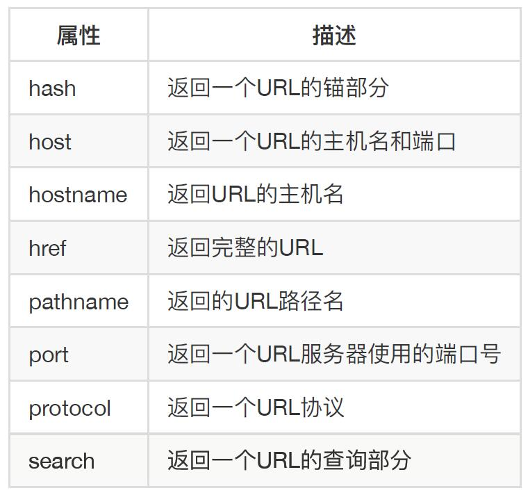

# window 对象

bom主要就是window对象上的方法（document被分到了dom里。document是window里面的属性）
本节课学习的知识几乎每一个浏览器一个样子。所以很少用

## 自身方法

- open：用js打开一个新窗口。弹窗不用该方法
  - `open("页面路径","打开目标","配置")`。第一个参数必须传，第二个参数表示是否新窗口打开，默认值浏览器各不同，第三个参数往往是弹窗才会用到

```js
// <iframe name="myframe" src="" frameborder="0"></iframe>
// document.querySelector("button").onclick = function () {
//   window.open("https://www.jd.com", "_blank");
// };
// document.querySelector("button").onclick = function () {
//   window.open("https://www.jd.com", "myframe");
// };
document.querySelector("button").onclick = function () {
   window.open("https://www.jd.com", null, "width=300,height=300");
};
      document.querySelector("button").onclick = function () {
        var w = window.open("test2.html", null, "width=300,height=300");
        w.resizeTo(500, 500);
      }; //关于屏幕的配置还有很多。但是兼容性严重到一个浏览器一个样子。不要去用
```

- alert。这个样式控制不了。所以测试用一下但平时不会用到
- confirm。弹窗若点击确定返回值为true否则为false
- prompt。提示输入，现在不用

## 对象属性

- document.write：在当前文档流中写入内容，如果当前文档流不存在，则新开一个文档流。见test2.html。平时用不到
- location：地址栏对象！
    - href 属性：得到目前地址栏的地址```console.log(location.href)```、该属性可以被赋值
    - 其他属性参考 location.jpg
    - 
    - reload 方法：刷新当前页面。重新加载！
- navigator。与浏览器相关的一些信息
    - 
    - 浏览器大战的遗留问题，所以这些信息很多都是骗你的，而且有些都得不到
- history：用来表示历史记录，即之前访问过哪些记录（为避免侵犯隐私，只能获取到当前网站的历史记录的简单信息）！
    - go 方法。技能前进也能后退，参数为正数即前进几个页面，负数即后退几个页面
    - back 方法。后退
    - forword 方法。前进。这三个方法可以让浏览器前进或后退
- console
    - log 方法：打印对象的 valueOf 的返回值（默认情况下对象的valueOf方法返回本身，但是有一些重写了，dom对象重写了这个方法会覆盖掉本身打印的是元素结构。如果想要对象结构用dir方法）
    - dir 方法：打印对象结构
    - time 方法和 timeEnd 方法：用于计时。通常用于计算某一段代码的运行时间
```js
console.log(document.body);//元素结构
console.dir(document.body);//对象结构

      console.time("测试");
      var sum = 0;
      for (var i = 0; i < 10000; i++) {
        sum += i;
      }
      console.timeEnd("测试"); //参数要成对写。即time和timeEnd参数可以不写，写要写一样
```