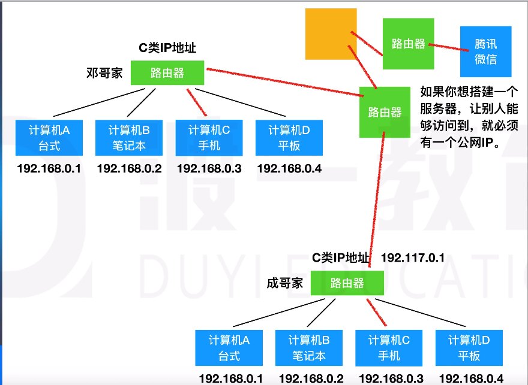

# IP 地址与公网

## IP 地址

同一局域网内 ip 地址不重复

IP 地址的格式：IP 地址分为四个段：`***.***.***.***`,每个段 0~255，每个段都是由 8 个 0、1 组成的

IP 地址的分类：

一个 IP 地址分为两个部分：网络 ID、主机 ID

A 类：0.0.0.0~127.255.255.255(一个网络能有 1600+万台设备)
B 类：128.0.0.0~191.255.255.255(阿里云 ip 大致为 172.16.0.0~172.31.255.255)
C 类：192.0.0.0~223.255.255.255(私有 ip 地址一般为`192.168.***.***`)
D 类：(多播地址)
E 类：

> 查看本机 ip 地址：window + R --> 输入 cmd --> 输入(命令) ipconfig/ping www.baidu.com(ip地址)

