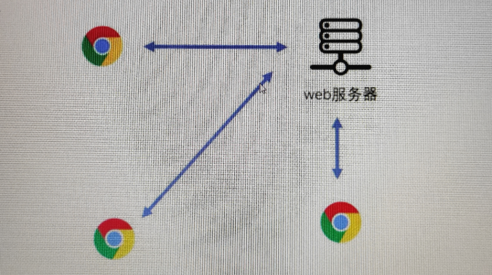
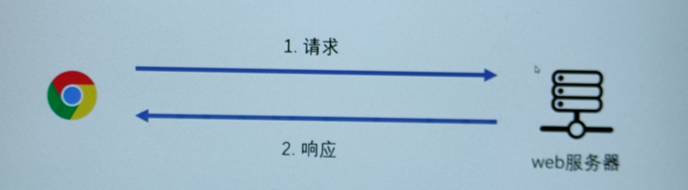

# HTTP 协议

## 什么是服务器

如果所有的程序都是单机的，会导致什么后果呢？

1. 数据难以共享
2. 受计算机配置影响，运算速度差异巨大
3. 个人计算机的安全性堪忧，可能受到恶意程序的影响

有了服务器之后，这些问题都可以轻松解决

服务器在不同的语境下可以表达了不同的含义：

1. 一台独立的计算机
2. 一个应用程序(多)

绝大部分使用，作为开发者，通常把服务器看作是一个**应用程序**

无论它是那个概念，他都至少具有下面的特点：

1. 能够通过网络，被其他程序访问
2. 能够提供一些服务


如果一个服务器(应用程序)，它 仅仅为一个浏览器访问网站服务，我们称它为**web 服务器**

> 实际上，目前的 web 服务器和游戏服务器界限已经非常模糊，可以认为，凡是在互联网中提供服务的服务器都是 web 服务器



通常，我们把访问服务器的程序，称之为客户端(和服务器进行交互)

> 实际上，web 服务器不仅限于为浏览器提供服务，还可以为收集 app、小程序、小游戏等常见互联网应用提供服务(本课程只考虑浏览器)

常见的 web 服务器有：nginx、apache、iis

在开发阶段，web 服务器往往安装本地计算机，通常也称之为本地服务器(对应有远程服务器，可在阿里云上购买)，本地服务器只能在本地计算机或局域网内访问到

> vscode 有一个 live server 插件，其实他就是一个轻量级的 web 服务器

## 如何访问服务器

服务器程序可能在本机，也可能在远程，他一定运行在某一台计算机上

要在茫茫互联网中访问到服务器程序，就必须：

1. 精确的定位到服务器所在的计算机
2. 精确的定位到计算机中的服务器程序
3. 精确定位到程序中的某个功能

通常，我们使用 url 地址来描述以上 3 个信息

url 地址全称为 Uniform Resourse Locator，统一资源定位符，是一个字符串。他的格式如下：

`protocol://hostname:port/path?query#hash`

例`https://www.baidu.com/s?cl=3&tn=baidutop10&fr=top1000&wd=%E7%89%B9%E6%9C%97%E6%99%AE%E5%8F%91%E6%96%87%E7%A7%B02020%E6%80%BB%E7%BB%9F%E9%80%89%E4%B8%BE%E8%BF%9D%E5%AE%AA&rsv_idx=2&rsv_dl=fyb_n_homepage&hisfilter=1`

- protocal：使用的协议(标准)，选择不同的协议，会导致和服务器之间消息交互格式、连接方式不同，大部分的服务器支持 http 和 https 两种协议。如果选择了服务器不支持的协议，会导致访问失败(浏览器会默认使用 http 协议)

- hostname：主机名，可以是 ip、域名

  - ip：每台计算机在网络中的唯一编号，127.0.0.1 表示本机
  - 域名：网络中容易记忆的唯一单词，www.baidu.com就是域名，通过 DNS 服务器可以将域名解析称 IP(域名解析)，localhost 会被解析为 127.0.0.1(需要买的)

`查看本机 ip 地址：window + R --> 输入 cmd --> 输入(命令) ipconfig/ping www.baidu.com(ip地址)`:并不是所有的服务器都支持 ip 地址访问

- port：端口号，0~65535 之间的数字，相当于服务器计算机上的序号，使用不同的端口号相当于敲不同房间的门。计算机上的一个程序可以监听一个或多个端口号，一个端口号只能被一个程序监听，如果访问的端口号有程序被监听，则计算机会将到达的网络访问交给对应的程序来处理(用来确认定位服务器中的程序)

  - 端口号可以不写，使用默认值
  - http 协议默认值 80，例`http://www.baidu.com:80/`
  - https 协议默认值 443，例`https://www.baidu.com:443/`

- path：路径。一个普通的字符串，该字符串会交给 web 服务器处理，主要用于定位服务，一定是以/开头的

  例：http://duyi.com/给你渡一的首页 http://duyi.com/news给你渡一的新闻页

  - 如果 path 为`/`,则表示根路径，如`http://www.baidu.com/`的 path 就就是`/`

- query：也叫 search，一种特殊格式的字符串，该字符串会交给 web 服务器处理，主要用于向服务器某个服务传递一些信息

例：https://www.baidu.com/s?wd=html

- 格式为：`属性名= 属性值&属性名=属性值`属性值即想要搜索的关键字

- hash：一个普通的字符串，在浏览器的地址栏中，如果 url 其他位置的信息保持不变，进变动 hash。浏览器不会重新访问服务器，因此通常用于不刷新的页面内跳转

可以看出：

- hostname 主机名 是用于精准定位计算机的
- port 端口号 是用于精准定位服务器的
  以下四个都是用来定位服务器信息的
- protocal 是用于告诉服务器使用哪种协议进行传输数据
- path 是用于精准定位服务器上的服务的，一定是以/开头的
- query 是在使用服务的时候传递的额外信息。具体看服务器要求
- hash 是一些额外信息，服务器要不要用具体看服务器要求

示例：分析出下面 url 地址的各部分内容

`https://baike.baidu.com/item/HTML?a=1#1`

注意：url 仅支持 ASCII 字符，如果是包含非 ASCII 字符，会被现代浏览器自动进行编码

例如：`https://www.baidu.com/s?wd=王思聪`会被编码为`https://www.baidu.com/s?wd=%E7%8E%8B%E6%80%9D%E8%81%AA`

> url 地址不能过长，因为很多浏览器对 url 地址长度是有限制的，chrome 对 url 的长度限制为 8182 个 ASCII 字符

## http 协议

我们可以通过 url 地址访问服务器，但是，浏览器和服务器之间的数据到底是怎么交互的，数据的格式是什么，这取决于使用什么协议

最常见的协议，就是 http 协议

http 协议将和服务器的一次交互看作是两段简单的过程组成：**请求 request**和**响应 response**

- 请求：客户端通过 url 地址发送数据到服务器的过程
- 响应：服务器收到请求数据后反馈数据给客户端的过程



当请求-响应完成后，本次交互结束，如果需要得到额外的服务，则需要重新发送新的请求

同时，http 协议约定了请求的信息格式和响应的消息格式

### 请求消息格式

请求消息格式由两个部分组成：**请求头 request headers**和**请求体 request body**

#### 请求头

请求头是一个多行文本的字符串

比如我们请求`http://www.baidu.com/s?wd=html`，得到的请求头可能如下：

```
GET /s?wd=html HTTP/1.1
Host:www.baidu.com
User-Agent:Mozilla/5.0(Window NT 10.0;Win64;x64)AppleWebkie/537.36(KHTML,like Gecko)Chrome/79.0.3945.88
...
```

可以看出，该字符串(多行文本字符串)由两个部分组成

1. 请求行：请求方法、 path、 协议

   1. 请求方法：一个普通的字符串，会被服务器读取到。常见的请求方法：GET、POST；即开发中使用什么样的请求方法要看服务器认什么样的请求方法，一般来说不要标新立异
   2. path：即 url 中的 path+search+hash，服务器可能会用到 path 中的信息
      例：http://www.baidu.com/s?wd=html#123，url中的path是/s，请求行中的path是/s?wd=html#123
   3. 协议：协议以及版本号，目前固定为 HTTP/1.1
      url 用来精确定位服务器，定位后给服务器传递信息只能从请求头、请求体中获取

2. 键值对：大量的属性名和属性值的组合，可以自定义，格式为`属性名：属性值`

   1. Host：url 地址中的 hostname
   2. User-Agent：客户端信息描述，可以伪造着写
   3. 其他键值对(主要看服务器需要什么信息)

请求头描述了请求的**元数据(与业务数据无关的额外信息)**信息，这里的元数据信息是指与业务数据无关的额外信息

当我们在浏览器地址栏输入了一个 url 按下回车后，浏览器会自动构建一个请求头，请求方法为 GET，然后向服务器发送请求

#### 请求体

包含业务数据的字符串(服务器要求的，不是 http 协议规定的)

理论上，请求体可以是任意格式的字符串，但习惯上，服务器普遍能识别以下格式：

- application/x-www-form-urlencoded：属性名=属性值&属性名=属性值...
- application/json：`{"属性名":"属性值","属性名":"属性值"}`
- multipart/form-data：使用某种随机字符串作为属性之间的分隔符,通常用于文件上传(大量的数据)

由于请求体格式的多样性，服务器在分析请求体时可能无法知晓具体的格式，从而不知道如何解析请求体，因此，服务器往往要求在请求头中附带一个属性 Content-Type 来描述请求体使用的格式

例如：

```
Content-Type:application/x-www-form-urlencoded
Content-Type:application/json
Content-Type:multipart/form-data

```

#### GET 和 POST

虽然 http 协议并没有规定请求方法是什么，但随意的请求方法服务器可能无法识别

服务器一般都能识别 GET 和 POST 请求，并做出以下的差异化处理(根源)

1. 如果是 GET 请求，不读取请求体，业务数据(一般放到地址里面)从 path 的 /query/search 或 hash 中读取
2. 如果是 POST 请求，读取请求体，业务数据从请求体中获取，关于请求体的格式，不同的服务器、同一个服务器的不同服务要求不同

> 在浏览器地址栏中输入 url 地址是不能产生 POST 请求的，可以使用表单提交产生 POST 请求

```html
<form action="http://www.baidu.com/" method="POST">
  <p>账号<input type="text" /></p>
  <p>密码<input type="password" /></p>
  <p><button>提交</button></p>
</form>
```

由于服务器对 GET 和 POST 处理的差异(根源)，造成了 GET 和 POST 请求的差异：

1. GET 请求一般没有请求体，POST 请求有
2. GET 请求的业务数据放在地址中，安全性较差(误分享、被偷窥)
3. GET 请求传递的业务数据量是有限的，POST 是无限的(除非服务器限制)
4. GET 请求利于分享页面结果，POST 不行
5. 在浏览器中刷新或退页面时，会按照该页面之前的请求方式重新发送请求，如果是 GET 请求，浏览器会重新发送 GET 请求，如果是 POST 请求，浏览器会重新构建之前的信息体数据，通常会弹出提示

### 响应信息格式

服务器根据请求头和请求体创建(怎么创建的不必知道，与你无关，除非你自己写)一个响应头和响应体，发送给客户端(如何做？)

和请求类似，响应消息也分为**响应头(response headers)**和**响应体(response body)**

#### 响应头

比如我们请求`http://www.baidu.com/s?wd=html`，得到的响应头可能如下：

```
HTTP/1.1 200 OK
Content-Type:text/html;charset=utf-8
Server:BWS/1.1
```

可以看出，该字符串有两个部分组成

1. 响应行：协议 状态码 状态文本

   1. 协议：协议以及版本号，目前固定为 HTTP/1.1
   2. 状态码和状态文本：一个数字和数字对应的单词，来共同描述服务器的响应状态，浏览器会根据该状态码做不同的处理
      1. 200 OK：一切正常。···你好，我好，大家好
      2. 301 Moved Permanently：资源已被永久重定向。···你的请求我收到了，但是呢，你要的东西不在这个地址了，我已经永远的把它移动到了一个新的地址，麻烦你去请求新的地址，地址我放到了请求头的 Location 中了
      3. 302 Found：资源已被临时定向。 ···你的请求我收到了，但是呢，你要的东西不在这个地址了，我临时的把它移动到了一个新的地址，麻烦你去请求新的地址，地址我放到了请求头的 Location 中了
      4. 304 Not Modeified：文档内容未被修改。···你的请求我收到了，你要的东西和之前是一样的，没有任何的变化，所以我就不给你结果了，你自己就用以前的吧。啥？你没有缓存以前的内容，关我啥事
      5. 400 Bad Request :语义有误，当前请求无法被服务器理解。···你给我发的是啥啊，我听都听不懂
      6. 403 Forbidden：服务器拒绝执行。···你的请求我收到了，但是我就是不给你东西
      7. 404 Not Found：资源不存在。···你的请求我收到了，但我没有你要的东西
      8. 500 Internal Server Error：服务器内部错误。···你的请求我已收到，但这道题我不会，解不出来，先睡了
      9. 通常认为，0~399 之间的状态码都是正常的，其他是不正常的

2. 键值对：大量的属性名和属性值组合，可以在服务器响应的时候自定义

   1. Content-Type：响应体中的数据格式，常见格式如下(决定浏览器是怎么渲染的)

      1. text/plain：普通的文本，浏览器通常会将响应体原封不动的显示到页面上
      2. text/html：html 文档，浏览器通常会将响应体作为页面进行渲染(常见)
      3. text/javascript：js 代码，浏览器通常会使用 js 执行引擎将它解析执行
      4. text/css：css 代码，浏览器会将它视为样式
      5. image/jpeg：浏览器会将它视作 jpg 图片
      6. attachment：符键，浏览器看到这个类型，通常会触发下载功能
      7. 其他 MIME 类型

   2. Server：web 服务器类型

#### 响应体

响应消息的正文

## 在浏览器地址栏中输入一个页面网址，按下回车键后发生了什么？

1. 浏览器将 url 地址补充完整：没有书写协议，添加上协议
2. 浏览器对 url 地址进行 url 编码：如果 url 地址中出现非 ASCII 字符，则浏览器会对其进行编码
3. 浏览器构造一个没有消息体的 GET 请求，发送至服务器，等待服务器的响应，此时浏览器标签页往往会出现一个等待的图标
4. 服务器接收到请求，(通过一系列操作)将一个 HTML 页面代码组装到消息体中，响应给浏览器
5. 浏览器拿到服务器的响应后，丢弃掉当前页面，开始渲染消息体的 html 代码。浏览器之所以知道这是一个 html 代码，是因为服务器的响应头指定了消息类型为 text/html
6. 浏览器在渲染页面的过程中，发现有其他的嵌入资源，如 CSS(将相对路径转换为绝对路径)、Js、图片等
7. 浏览器使用不阻塞渲染的方式，重新向服务器发送对该资源的请求，拿到响应结果后根据 Content-Type 做相应处理
8. 当所有的资源都已经下载并处理后，浏览器触发 window.onload 事件

## ajax

不仅仅是浏览器可以发出请求并获得相应，任何具有网络通信能力的程序均可以这样做

过去，在浏览器中，只有浏览器本身有发送请求的能力，直到 ajax 的出现

ajax 是一个技术，让 js 语言在浏览器环境中获得了新的 API，通过该 API，js 代码拥有了和服务器通信的能力

传统的 ajax 代码如下：

```js
var xhr = new XMLHttpRequest(); //创建发送请求的对象
xhr.onreadystatechange = function () {
  //当请求状态发生改变时运行的事件函数
  //xhr.readyState：一个数字，用于判断请求到了那个阶段
  //0：刚刚创建好了请求对象，但还未配置请求(未调用open方法)
  //1：open方法已被调用
  //2：send方法已被调用
  //3：正在接收服务器的响应消息体
  //4：服务器响应的所有内容均已接收完毕
  //xhr.responseText：获取服务器响应的消息体文本
  //xhr.getResponseHeader("Content-Type")获取响应头Content-Type
  xhr.setRequestHeader("Content-Type", "application/json"); //设置请求头(看服务器怎么要求)
  xhr.open("请求方法", "url地址"); //配置请求
  xhr.send("请求体内容"); //构建请求体，发送到服务器
};
```

> 使用 ajax 访问：http://yuanjin.tecn:5100/api/local

live server 插件：监听某个端口 5500(默认),当请求本机该端口时，会读取 url 中的 path，将该 path 和当前项目文件夹中的根目录进行拼接，成为一个完整的文件内容，响应为客户端。
