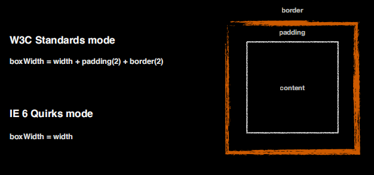

# box

一个盒模型功能的强弱直接决定了布局结构的简单与否、后续编程是否复杂

## IE6 混杂模式的盒子

boxWidth = width + border*2 + padding*2

boxWidth = width

contentWidth = width - border*2 - padding*2

IE6 混杂模式的盒子更关注盒子整体的宽度

- box-sizing：默认 content-box/border-box

应用场景：宽度不固定、padding 固定

### overflow

- overflow:visible 默认值/hidden 溢出隐藏/scroll/ 溢出部分滚动呈现/auto 按需出现滚动条/clip,可以单独设置 overflow-x、overflow-y；若其中一个方向设置非 visible 另一个方向自动设为 auto

### resize

- resize:none/both/vertical/horizontal，想要生效需要和 overflow(值可以是 auto、hidden、scroll) 搭配使用，应用不多

## ！弹性盒子

在原来盒模型的基础上提供的一个功能;常称父级为盒子，子级为项目

实现：给一个元素设置`display:flex/inline-flex;`这个盒子就变成了一个具备弹性功能的盒子区域，有主轴和交叉轴

1. 设置到父元素上的属性：

- flex-direction:row 默认水平自左至右/row-reverse/column/column-reverse;设置主轴方向，交叉轴基于主轴发生变化

- flex-wrap:nowrap 默认不换行/wrap/wrap-reverse 是否换行

- justify-content：flex-start/flex-end/center/space-between/space-around,基于主轴帮助我们做一个对齐方式

- align-items:flex-start/flex-end/center/baseline/stretch,基于交叉轴进行位置分配,主要还是针对单行元素来处理对齐方式的

  - baseline:基于文字底线对其
  - stretch:若不设置子级宽高，该属性会自动帮你 chen 开

- align-content：flex-start/flex-end/center/baseline/stretch，只针对多行元素的对齐方式

2. 设置到子元素上的属性：

- order：默认值 0，类似 z-index， 数值小的排在前面

order 大的虽然在小的的后面，但是逻辑层面上是在小的的上头

- align-self：flex-start/flex-end/center/baseline/stretch，子项作为一个个体基于交叉轴的一个分配状况

> 优先级：align-content > align-self > align-items

3. flex:flex-grow 伸/flex-shrink 缩/flex-basis 基础;（！核心伸缩功能）;

- flex-grow:;默认值 0；当这一行(主轴)还有剩余空间的时候，系统会根据 flex-grow 设置的比例来分配剩余空间以调整自己的大小

- flex-shrink:默认值是 1;

  - 无 border/padding：`单个盒子压缩值 = (单个盒子宽度*flex-shrink 值)/(盒子1宽度*盒子1的flex-shrink值+盒子2宽度*盒子2的flex-shrink值+盒子3宽度*盒子3的flex-shrink值)*总体超出部分宽度`

  - 推理出：`单个盒子压缩值 = (单个盒子真实内容区宽度*flex-shrink 值)/(盒子1真实内容区宽度*盒子1的flex-shrink值+盒子2真实内容区宽度*盒子2的flex-shrink值+盒子3真实内容区宽度*盒子3的flex-shrink值)*总体超出部分宽度`即真实内容区的大小\*shrink+..

  - 无论什么情况下，被不换行内容撑开的容器，不会被压缩计算

- flex-basis:默认值 auto (和 width 对齐);

  - 只写 basis，代表元素的最小宽度

  - 设置了 width 且 flex-basis < width，则内容区文字的高度满足： basis < realWidth < width

  - flex-basis > width(basis 代表元素的最大宽度)

- word-break:break-word;英文换行属性

> align-items、align-content 默认值 stretch(若不设置子元素高，会帮你陈开)

- flex-flow:flex-direction/flex-wrap
