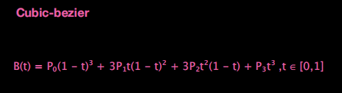

## transition 过渡

面向想象编程哈哈`^_^`

transition 会帮助我们监控是否有状态变化，有且发生状态变化的属性(支持动画过渡)就以动画过渡的形式改变状态

display 不支持过渡

属性介绍(复合属性)：transition:transition-property transition-duration transition-timing-function transition-delay;

- transition-property:;默认值 all，适用于所有元素包含伪元素:before 和:after，帮助我们监听改变状态的属性

- transition-duration:;默认值 0，适用于所有元素包含伪元素:before 和:after，表示过渡动画需要多长时间完成

- transition-timing-function:;默认值 ease 平滑过渡，linear 线性过渡(匀速)|ease-in 由慢到快|ease-out 由快到慢|ease-in-out 由慢到快再到慢，表示过渡动画运动状态的曲线

- transition-delay:;默认值 0s，表示多长时间后过渡

## cubic-bezier 贝塞尔曲线

三次贝塞尔曲线在表示运动状态的时候基本上就是一个 st 曲线


三次贝塞尔曲线方程式



cubic-bezier(number1,number2,number3,number4)

三次贝塞尔曲线由两部分组成：起点 P0 和终点 P3、控制点(number1,number2)和(number3,number4)

其中 x 轴数值在[0,1]之间，y 轴数值可以<0

## animation

能实现多状态连续改变的一个动画

```css
@keyframes run1 {
  from {
    background-color: brown;
  }
  60% {
    background-color: coral;
  }
  100% {
    background-color: cornflowerblue;
  }
}
```

@keyframes：关键帧容器，有兼容性问题，@-webkit-keyframes

关键帧都是用百分数定义的，只有 0%可以写成 from，100%可以写成 to；第一帧最好和原始状态一致

`animation: run 4s, run1 4s;`两个关键帧容器用逗号隔开，并行运动

animation 复合属性

- animation-name:;检索或设置@keyframes 动画的名称
- animation-duration:;动画的持续时间，默认值 0s
- animation-timing-function:;动画每一段的运动状态(曲线)
- animation-delay:;等待多久动画开始，默认值 0s
- animation-iteration-count:;动画的循环次数，默认值 1，infinity 无限循环。注意一旦开始动画，第二遍之后 delay 失效
- animation-diration:normal 默认值正常方向/reverse 反方向运行/alternate 先正向再反向交替运行(钟摆运动常见)/alternate-reverse;设置动画在循环中是否反向运动
- animation-fill-mode:;设置动画的状态，默认值 none
  - forwards：设置对象状态为动画结束时的状态(即结束后保留最后一帧的状态)
  - backwords：设置对象状态为动画开始时的状态(即动画开始前变成第一帧的状态)
  - both：设置对象状态为动画开始或结束时的状态，即动画开始前变成第一帧的状态，结束后保留最后一帧的状态
- animation-play-state:running 默认值运动/paused 暂停;设置对象动画的运动状态，不好用
