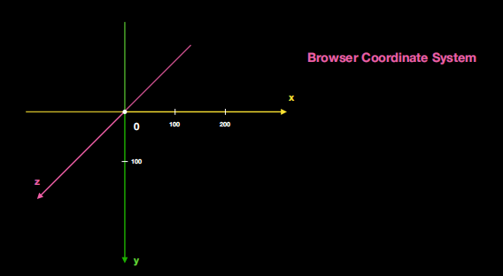
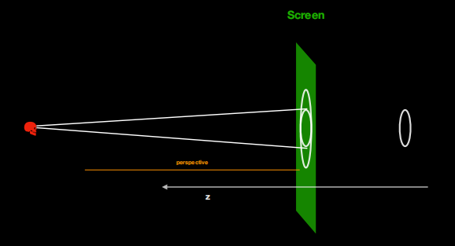

## transition 过渡

面向想象编程哈哈`^_^`

transition 会帮助我们监控是否有状态变化，有且发生状态变化的属性(支持动画过渡)就以动画过渡的形式改变状态

display 不支持过渡

属性介绍(复合属性)：transition:transition-property transition-duration transition-timing-function transition-delay;

- transition-property:;默认值 all，适用于所有元素包含伪元素:before 和:after，帮助我们监听改变状态的属性

- transition-duration:;默认值 0，适用于所有元素包含伪元素:before 和:after，表示过渡动画需要多长时间完成

- transition-timing-function:;默认值 ease 平滑过渡，linear 线性过渡(匀速)|ease-in 由慢到快|ease-out 由快到慢|ease-in-out 由慢到快再到慢，表示过渡动画运动状态的曲线

- transition-delay:;默认值 0s，表示多长时间后过渡

### cubic-bezier 贝塞尔曲线

三次贝塞尔曲线在表示运动状态的时候基本上就是一个 st 曲线


三次贝塞尔曲线方程式


cubic-bezier(number1,number2,number3,number4)

三次贝塞尔曲线由两部分组成：起点 P0 和终点 P3、控制点(number1,number2)和(number3,number4)

其中 x 轴数值在[0,1]之间，y 轴数值可以<0

## animation 动画

能实现多状态连续改变的一个动画

```css
@keyframes run1 {
  from {
    background-color: brown;
  }
  60% {
    background-color: coral;
  }
  100% {
    background-color: cornflowerblue;
  }
}
```

@keyframes：关键帧容器，有兼容性问题，@-webkit-keyframes

关键帧都是用百分数定义的，只有 0%可以写成 from，100%可以写成 to；第一帧最好和原始状态一致

`animation: run 4s, run1 4s;`两个关键帧容器用逗号隔开，并行运动

animation 复合属性

- animation-name:;检索或设置@keyframes 动画的名称
- animation-duration:;动画的持续时间，默认值 0s
- animation-timing-function:;动画每一段的运动状态(曲线)
- animation-delay:;等待多久动画开始，默认值 0s
- animation-iteration-count:;动画的循环次数，默认值 1，infinity 无限循环。注意一旦开始动画，第二遍之后 delay 失效
- animation-diration:normal 默认值正常方向/reverse 反方向运行/alternate 先正向再反向交替运行(钟摆运动常见)/alternate-reverse;设置动画在循环中是否反向运动
- animation-fill-mode:;设置动画的状态，默认值 none
  - forwards：设置对象状态为动画结束时的状态(即结束后保留最后一帧的状态)
  - backwords：设置对象状态为动画开始时的状态(即动画开始前变成第一帧的状态)
  - both：设置对象状态为动画开始或结束时的状态，即动画开始前变成第一帧的状态，结束后保留最后一帧的状态
- animation-play-state:running 默认值运动/paused 暂停;设置对象动画的运动状态，不好用

### step 逐帧动画

配合 animation 来使用共同完成一个新形式(跳转)的动画

是 timing-function 里面的一个属性值，与贝塞尔曲线必须有取舍，和过渡动画的原理差不多

- steps(1,默认值 end/start)
  - 第一个参数代表每一帧的步数
  - end：保留当前帧的状态，直到动画时间结束(最后一帧的状态往往瞬间结束)。用 forwords 可以弥补
  - start：保留下一帧的状态，直到动画时间结束。用 backwords 只有开始前有等待时间才有意义

step-start：等同于 steps(1, start)
step-end：等同于 steps(1, end)

## transform

### rotate()旋转

- 角度 angle 的单位有角度 deg、梯度 grad、弧度 rad、圈 turn

- transform-origin: center center;旋转中心的位置

笛卡尔坐标系



demo：实现 3D 旋转

rotateX(),rotateY(),rotateZ()

perspective: 800px; 加在父级，将元素当作一个 3D 空间的元素<==>即给元素加上一个 3D 空间的视角 800px
transform-style: preserve-3d;<==>增强了一个 3D 折叠层

> 元素旋转之后，它所参照的坐标轴也是跟着旋转的

rotate3d()：`transform: rotate3d(x, y, z, angle);`

矢量向量

### scale 伸缩：2D 的一个伸缩变换,值>1 扩张<1 缩小

scale(x,y),scalex(),scaley(),scalez(),scale3d()

- 伸缩的是此元素的变化坐标轴的刻度
- scale 有叠加操作如`transform: scale(0.5, 0.5) scale(3, 3);`
- 伸缩的坐标轴会随着旋转发生变化，但是 scale 雁过留声(所有伸缩过的方向对后续还保留影响)

### skew 倾斜,只是一个 2d 变换

skew(x,y),skewx(),skewy(必须填角度 deg)

- skew 倾斜的是元素的坐标轴，设置 x 轴倾斜度，倾斜的是 y 轴(刻度会发生变化) `transform: skew(45deg, 0deg) translateY(100px);`

### translate 平移

2d 的写法 translate(x,y),translatex(),translatey(),translatez(),translate3d()

以自身 translate-origin 为参照位置平移

```css
position: absolute;
left: 50%;
transform: translateX(-50%);
```

以上可解决自身宽高不确定的情况下如何移动半个身位

### perspective 景深

`perspective: 800px;`景深必须设到父级上，可以叠加，相应的子元素才会有影响

设置景深相当于我们距离屏幕是真正的有一个空间上的纵深了，增加了立体感

`perspective-origin: center center;`景深视角(眼睛位置)



我们看到的 perspective 的结果是基于元素在屏幕上的投影

`transform: perspective(800px) rotateY(45deg);`perspective 属性值只能写在子级上，而且视角 center 无法更改，不常用

- transform-style:flat 默认值平面内/preserve-3d 三维空间内;加在直接父级上(3d 渲染堆叠层)

- backface-visibility: visible 默认值/hidden;能否看到背面

### matrix 矩阵(线性代数，规则的二维数组)偏底层的一个知识点

transform 的一个属性值，

矩阵的数学规则，乘法的前提条件：第一个矩阵的列数===第二个矩阵的行数，第二个矩阵为几列，得数即为几列

矩阵 matrix 就是 transform 给我们选中的计算规则

第二个矩阵就是图片原始坐标
