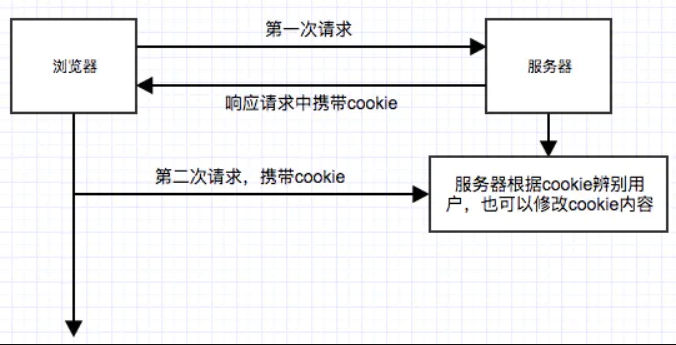

# cookie（代码层面的具体操作）

本地化存储的方式有很多。和网络息息相关，非常重要。

cookie：浏览器里面存储数据的东西

1. 思考问题：为什么有 cookie(cookie 的重要性及运行机制)

答：cookie 能长期存储数据，（为什么需要长期存储协议）

- http 协议是上下文无关协议 即无状态协议；在同一个链接(请求地址)中，两个执行成功的请求之间是没有任何关系的；用户没有办法在同一个网站中进行连接的交互。比如：登录页面、购买的购物车



set-cookie：服务器设置的

浏览器自动存储 cookie；之后每次http请求都会携带 cookie(存多了浪费空间)，服务器会根据 cookie 辨别用户，也可以修改 cookie 的内容
cookie的存储要慎重，避免对网络的开销过大

## cookie 的特点

1. cookie 不可以跨域（协议、域名、端口号）；不同的域名之间不能互相访问，一级域名二级域名除外(例百度-百度知道)
2. cookie 存储在浏览器里面
3. cookie 有数量、大小的限制，存不了太多的东西；超过的浏览器会删除(限制及怎么删除各浏览器不一样)
   - 数量在 50 个左右
   - 大小在 4kb 左右
4. cookie 的存储时间非常灵活，可以长期存储数据，也可以在页面关闭时就删除
5. cookie 不光可以服务器设置，客户端也可以设置，

通过 document.cookie(可读可写，键值对的字符串)；cookie 每次只能设置一个

```js
document.cookie = "name=kaivon";
document.cookie = "name=kaivon2; age=18";
//cookie 每次只能设置一对name=value。所以第二次设置的age=18并没有生效
```

## cookie 的属性（可读可写）

以键值对的形式书写

1. name： cookie 的名字，具有唯一性
2. value： cookie 的值
3. domain： 设置 cookie 在那个域下是有效的(限制条件：域名hostname)
   1. 默认为当前页面的域名
4. path： cookie 能够有效使用的路径(限制条件：路径)
   1. 一般会和domain配合使用，限制域名
5. expires: cookie 的过期时间，可选的属性，不给的话默认 Session 即会话期会在浏览器关闭的时候生命周期到头
   - 赋值设置时用 GMT 格式（格林尼治标准事件，日期的一种格式），http1.0 的内容
   - 中国以北京东八区为标准
   - 关注格式。new Date()返回的就是GMT的格式
   - ```Thu Jul 08 2021 10:48:18 GMT+0800 (中国标准时间)```。其中+0800表示东八区
6. max-age： cookie 的有效期，http1.1 的内容。和expires很像
   - 和 expires 都是设置 cookie 的生命周期
   - expires 设置的是一个过期的时间点，max-age 是一个以秒为单位的时间段，表示cookie存活的时间
   - 取值：-1~表示临时的 cookie，不会生成；0~表示有效期已经到了；正数~能存活的时间周期
     ```js
     document.cookie = "padding=30; expires=" + new Date(2021, 1, 10);
      document.cookie = "padding=30; max-age=1";
      //注意：控制台不是定时器，到期了还在是很正常的。可以点击别的地方切换一下再回来就没有了
     ```
     以下属性对于前端来说只能读取无法操作更改。一切都是为了安全
7. HttpOnly： 有这个标记的 cookie，前端无法获取（即无法通过document.cookie得到
8. Secure： 设置这个的 cookie 只能通过 HTTPS 协议传输(主要是为了安全)
9. SameSite： 设置这个的 cookie 在跨域请求的时候不能被发送。跨域请求的时候避免网络攻击等
