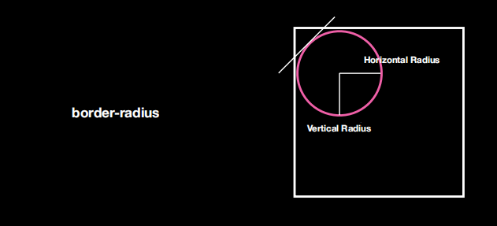
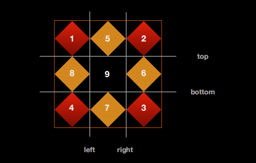

## border-radius

符合属性



## box-shadow

none：无阴影
第 1 个参数定义元素的阴影水平偏移值。正值，阴影出现在元素右侧；负值，则阴影出现在元素左侧
第 2 个参数定义元素的阴影垂直偏移值。正值，阴影出现在元素底部；负值，则阴影出现在元素顶部
第 3 个参数定义元素的阴影模糊值半径（如果提供了）。该值越大阴影边缘越模糊，若该值为 0，阴影边缘不出现模糊。不允许负值
第 4 个参数定义元素的阴影外延值（如果提供了）。正值，阴影将向四面扩展；负值，则阴影向里收缩
<color>：定义元素阴影的颜色。如果该值未定义，阴影颜色将默认取当前最近的文本颜色
inset：定义元素的阴影类型为内阴影。该值为空时，则元素的阴影类型为外阴影(常写在前面)

## border-image

- border-image-source：可以写图片，支持渐变色 liner-gradient(red,green,blue)
- ！border-image-slice：截取的意思，可以填 1-4 个值(数字或百分比)top、right、bottom、left 的顺序，把背景图片分为九个部分，把其中 8 部分分布到 border 里面去，默认值是 100%；还可以填值 fill，表示内容区也可以被填充
- border-image-width：默认值 1，代表 1\*border-width 设置 border 里面能设置图片的宽度；一般不动它；auto 会取 slice 的值+"px"
- border-image-outset：图片向外延展的距离
- border-image-repeat：解决中间部分如何填充，stretch 默认值，拉伸/round 到倍数重复，不到拉伸/repeat 不够就重复/space 到倍数重复，不到用空白；可以水平垂直填两个参数

符合属性：border-image:source slice repeat(一般单独写)



## background

- background-image：可以放多个 url,也可以放渐变颜色生成器
- background-origin：图片打哪开始渲染,与结束渲染部位无关；看效果需要 no-repeat，默认值 padding-box；background-position 相对于 backgroud-origin 起始的点进行定位

- background-clip：设置图片从哪里开始截断，从哪里开始以外的部分都不显示背景图片；有四个值 border-box 默认值、padding-box、content-box、！text 以文字作为基础，拿文字的内容区来作为截背景图片的依据,以下两个属性搭配使用,注意兼容性写法`-webkit-background-clip: text;`
- text-fill-color：指定文字的填充颜色；注意兼容性写法`-webkit-text-fill-color`

```css
-webkit-background-clip: text;
background-clip: text;
-webkit-text-fill-color: transparent;
text-fill-color: transparent;
```

- background-repeat：取值 repeat-x、repeat-y、 round 到倍数重复，不到拉伸/space 到倍数重复，不到用空白 可以填两个值
- background-attachment：改变背景图片的定位参考物：取值 scroll 默认值相对于容器定位/local 相对内容定位/fixed 相对于可视区定位，若容器出可视区，图片也消失
- background-size：取值 cover 图片填充满容器，可能展示不全/container 可能会 repeat 或留白，先一条边对齐；都是用一张图片来填充背景

## 渐变颜色生成器

- linear-grandient()：渐变颜色生成器,线性渐变(线性)
  `background-image: linear-gradient(180deg, #008c8c 20px, pink 80px);`(角度，颜色 颜色开始位置，颜色 颜色开始位置)
  - 用角度值指定渐变的方向（或角度）。to left：设置渐变为从右到左。相当于: 270deg。to right：设置渐变从左到右。相当于: 90deg。to top：设置渐变从下到上。相当于: 0deg。to bottom：设置渐变从上到下。相当于: 180deg。这是默认值，等同于留空不写。
- radial-grandient()：渐变颜色生成器,径像渐变(放射性)，circle 圆、ellipse 椭圆、closest-corner 最近的角/closest-side 最近的边/farthest-corner 最远的角/farthest-side 最远的边
  `background-image: radial-gradient(circle farthest-corner at 100px 30px, #f00 20%, #0f0 40px);`(圆的圆心所在位置，颜色 颜色所占比例，颜色 颜色开始位置)
- repeating-linear-grandient()：
- repeating-radial-grandient()：

> 渐变色放置在 border-color、color 中都不好用，把它当作图片用

## color

- rgba()
- hsl(h,s,l)：
  - H：Hue(色调)。0(或 360)表示红色，120 表示绿色，240 表示蓝色，也可取其他数值来指定颜色。取值为：0 - 360
  - S：Saturation(饱和度)。取值为：0.0% - 100.0%
  - L：Lightness(亮度)。取值为：0.0% - 100.0%
- hsla(h,s,l,a)：
  - A：Alpha 透明度。取值 0 - 1 之间。
- transprent：transparent 是全透明黑色(black)的速记法，即一个类似 rgba(0,0,0,0)这样的值。

> border-color = currentColor 中转颜色 = color
