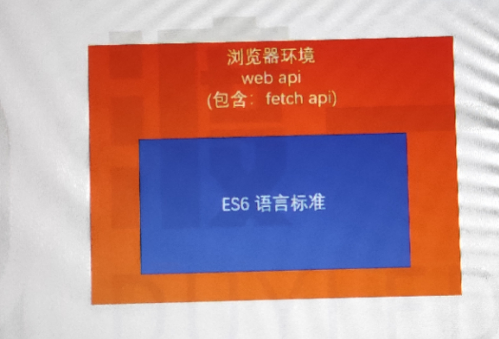

# Fetch Api 概述

fetch api并不是es6里面的知识。但是它涉及到了promise的知识。所以往往结合在一起讲解

出现一个全新的fetch api来做ajax请求的原因是：
- 过去用传统的方式XMLHttpRequest实现ajax请求有缺陷，繁琐（一般都封装一个函数或对象来解决繁琐的这个问题）

## XMLHttpRequest 的问题

1. 所有的功能都集中在同一个对象上，容易书写出混乱不易维护的代码（不利于功能的分割）
2. 采用传统的事件或回调函数驱动模式，无法适配新的 Promise Api（ajax就是典型的异步场景

## Fetch Api 的特点（解决XMLHttpRequest的问题）

1. 并非取代 ajax，而是对 ajax 传统 API 的改进
   1. ajax其实是一个标准。即在浏览器不刷新页面的情况下，通过浏览器的执行引擎，网络通信模块跟服务器发生交互
   2. 以前是用的XMLHttpRequest，只是对ajax的一种实现。出现了fetch之后，ajax的实现就有两种方式了

2. 精细的功能分割：头部信息、请求信息、响应信息等均分布到不同的对象，更有利于处理各种复杂的 ajax 场景

3. 使用 Promise Api，更有利于异步代码的书写

4. Fetch Api 并非 ES6 的内容，属于 HTML5 新增的 Web Api

5. 需要掌握网络通信的知识

promise的使用大部分都在fetch api这里 
