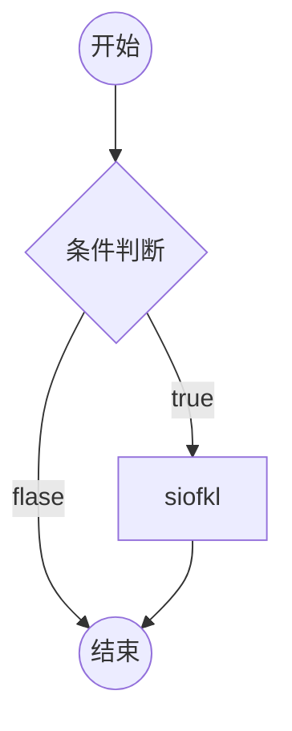
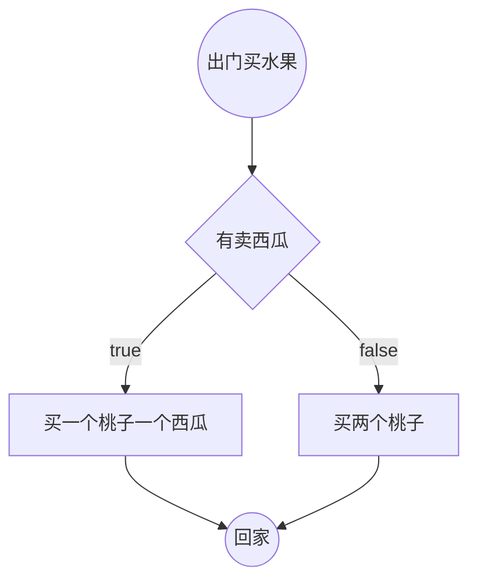
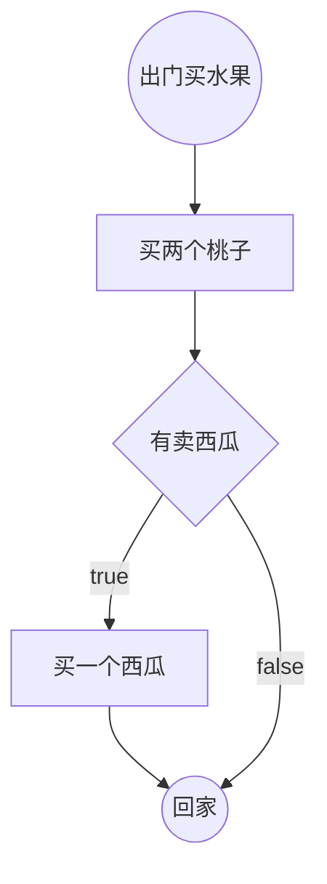

# 流程图(在markdown中画流程图)

一套标准的图形，用于描述程序的逻辑

通常流程图分析程序的流程

## 在markdown中画流程图

```mermaid
graph TD
start((开始))-->if{条件判断}
if -- true-->A[siofkl] 
if--flase-->ed((结束))
A-->ed((结束))
```

### 例子

1. 思维一

```mermaid
graph TD
start((出门买水果))-->if{有卖西瓜}
if--true-->A[买一个桃子一个西瓜]-->ed((回家))
if--false-->B[买两个桃子]-->ed((回家))
```
2. 思维二

```mermaid
graph TD
start((出门买水果))-->A[买两个桃子]-->if{有卖西瓜}
if--true-->B[买一个西瓜]-->ed((回家))
if--false-->ed((回家))
```