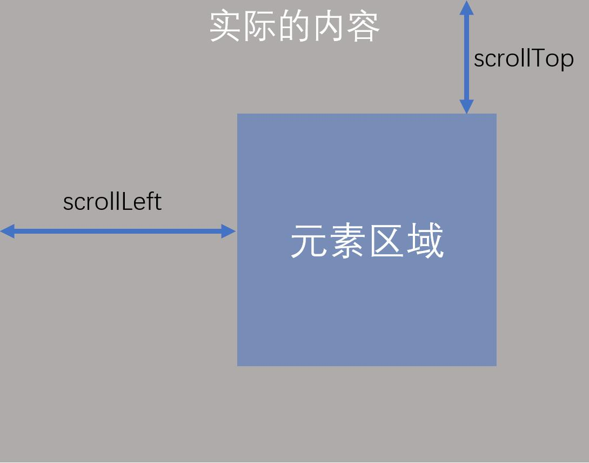

# 其他事件

## 表单事件

- focus：元素聚焦时触发(能与用户发生交互的元素，都可以聚焦)，该事件不会冒泡
- blur：元素失去焦点时触发，该事件不会冒泡
- submit：提交表单事件，仅在 form 元素有效
- change：文本改变事件
- input：文本改变事件，即时触发，无法阻止默认事件

```js
select.onchange = function (e) {
  console.log(e.target);
  console.log(this.options[this.selectedIndex].innerHTML);
};
```

## 其他事件

window：整个浏览器窗口

async：布尔属性，将浏览器的渲染方式改为异步渲染(尽量少用)

- load、DOMContentLoaded、readystatechange

  window 的 load：页面中所有资源全部加载完毕的事件(使用较少)

  图片的 load：图片资源加载完毕的事件

  document 的 DOMContentLoaded：必须用 dom2 的方式创建事件，dom 树构建完成后发生

  readystate：loading、interactive(触发 DOMContentLoaded 事件)、complete(触发 window 的 load 事件)

  readystatechange：

```js
//面试题：打印顺序？
console.log(document.readyState); //1
document.addEventListener("DOMContentLoaded", function () {
  console.log(document.readyState); //2
});
document.addEventListener("loaded", function () {
  console.log(document.readyState); //3
});
```

> 浏览器渲染页面的过程：1.得到页面源代码 2.创建 document 节点 3.从上到下将元素依次添加到 dom 树中，每添加一个元素，进行预渲染 4.按照结构，依次渲染子节点(看到 link 同步加载外部资源，加载后立即执行；看到 img、音频、视频会异步渲染)

**js 代码应该尽量写到页面底部：避免阻塞后续的渲染！，也避免运行 js 时，得不到页面中的元素**

**css 应该写到页面顶部：避免出现闪烁(如果放到页面底部，会导致元素先没有样式，使用丑陋的默认样式，当读到 css 文件后，会重新改变样式)**

```html

<script>
  var img = document.querySelector("img");
  console.log(img.width); //0:因为此时img只有元素，资源正在加载中......
</script>
```

- unload、beforeunload(先于 unload 发生)

beforeunload：window 的事件，关闭窗口时运行，可以阻止关闭窗口
unload：window 的事件，关闭窗口时运行，不可以阻止关闭窗口

```js
window.onbeforeunload = function () {
  return "该网页正在运行重要内容，关闭网页可能会损坏您的计算机，确认离开此页吗?"; //阻止关闭窗口，IE才有
};
```

- scroll：窗口发生滚动时运行的事件(元素上也会有 scroll 事件)



通过 scrollTop 的 scrollLeft，可以获取和设置元素上的滚动距离

window 上的滚动距离(存在兼容性问题，因此使用)：`document.documentElement.scrollTop + document.body.scrollTop`

- resize：窗口尺寸发生改变时运行的事件，监听的是视口尺寸，window 里面的事件


window.screen.width、window.screen.height：电脑屏幕尺寸
window.outerWidth、window.outerHeight：浏览器窗口外尺寸
window.innerWidth、window.innerHeight：浏览器窗口尺寸(包含滚动条)
document.documentElement.clientWidth、document.documentElement.clientHeight：视口宽高


div.offsetWidth、div.offsetHeight：含边框滚动条
div.clientWidth、div.clientHeight：包含内边距、内容，不含边框滚动条


div.scrollWidth、div.scrollHeight：实际内容的宽高，不包含滚动条

- contextmenu：右键菜单事件(可以给元素、window 注册事件，可以阻止默认行为)

- paste：粘贴事件，可以阻止默认行为

- copy：复制事件，可以阻止默认行为

- cut：剪切事件，可以阻止默认行为
