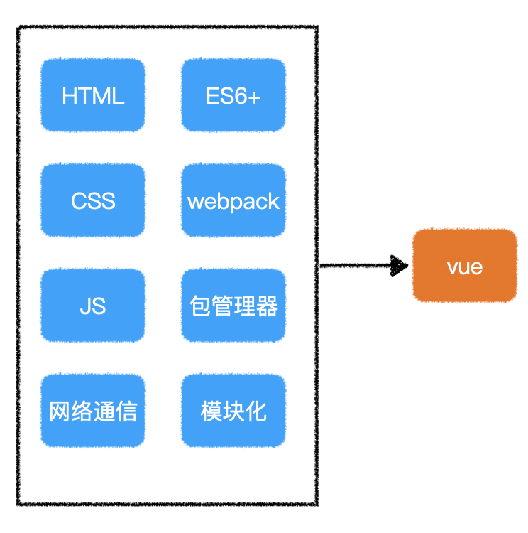
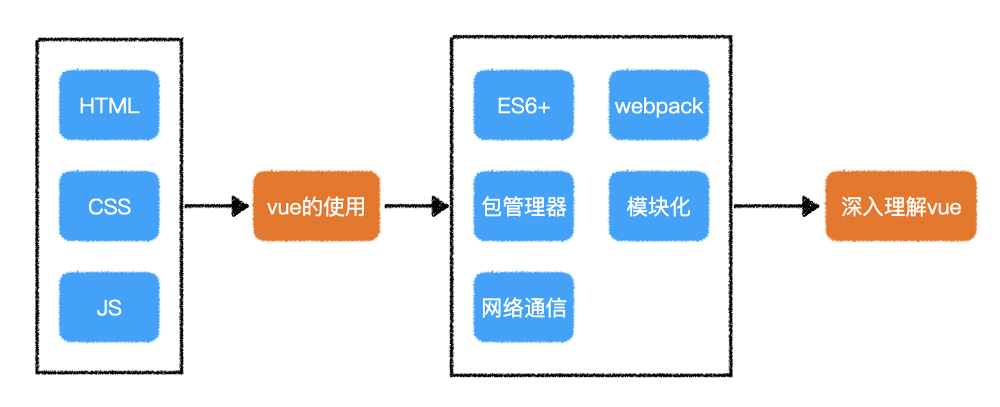

# 课程说明

1. **找组织**

2. **前置知识**

   学习过`html+css`、`JavaScript`的同学

3. **两种学习路径**

   1. 稳扎稳打
      

   2. 先用起来，再理解

      

4. **讲解方式**

   贯穿案例+知识点讲解

5. **如何学习**

   听课 -> 思考总结 -> 练习 -> 询问 -> 听课 -> ...

# vue 开发体验

> vue 官网地址：https://cn.vuejs.org/

1. **什么是 vue？**

   vue 是一个前端开发框架(加强版的库)，用于降低 UI 复杂度(复杂的 DOM 操作)

   UI: user interface 用户界面

2. **vue 的特点**

   - 渐进式：可以整体/部分使用
   - 响应式：
   - 组件化：可以多人同时开发页面

3. **应用场景**

   - 前台部分页面
   - 中后台全部页面

4. **体验 vue 代码**

   开发工具：[Visual Studio Code](https://code.visualstudio.com/)

   常用插件：

   - Auto Rename Tag：能够自动更改结束标签
   - Live Server：自动搭建本地服务器
   - Prettier - Code formatter：代码美化
   - Vetur：但 vue 组件格式支持
   - vscode-icons：美化文件图标
