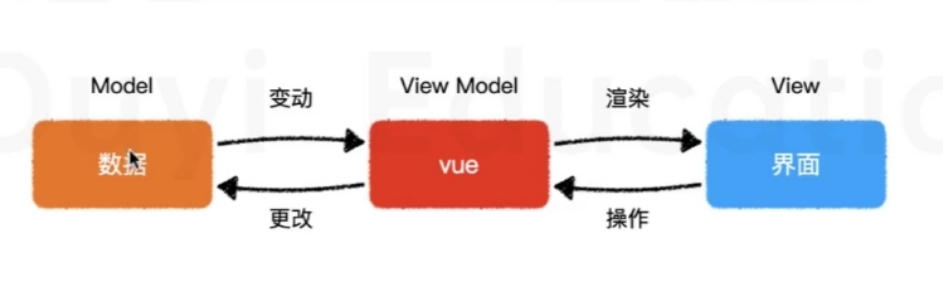

# vue 初体验

## 使用 vue 的两种方式

1. 页面中引入 vue 的 js 文件

2. 脚手架

   1. 官方脚手架：vue-cli
   2. 其他民间脚手架：webpack-simple
   3. 手动搭建

## 体验 vue 开发

vue 是根据将数据填充到模板中的相应区域渲染的

响应式布局(一切从改动数据出发)

MVVM：Model --> View --> View MOdel
