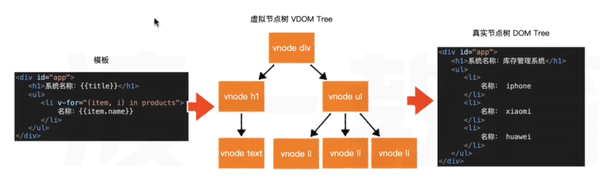
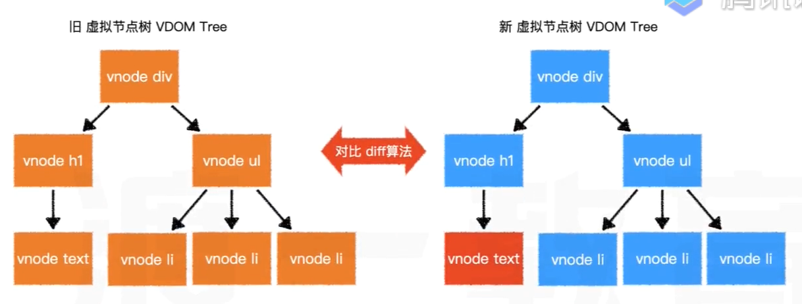
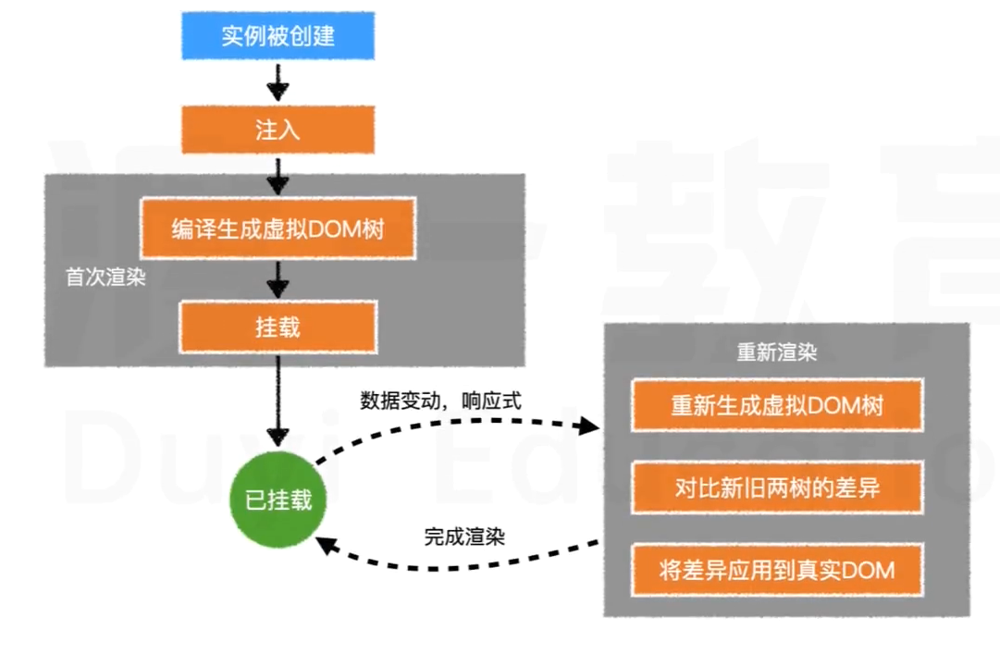

## ES6 知识补充

- 速写属性

- 速写方法

- 模板字符串

## 注入

配置对象中的部分内容会被提取到 vue 实例中：(响应式)

- data

- methods

该过程称之为**注入**

注入的目的有两个：

- 完成数据响应式

  vue 是怎么知道数据被更改了？
  vue2.0 是通过 Object.defineProperty 方法完成了数据响应式(缺陷：无法感知到新增属性、删除属性)，vue3.0 是通过 Class Proxy 完成的数据响应式

- 绑定 this

## 虚拟 DOM 树

为了**提高渲染效率**，vue 会把模板**编译**成为虚拟的 DOM 树，然后再生成真实的 DOM

```js
console.log(vm._vnode); //虚拟dom树，每次渲染结果都不同
console.log(vm._vnode.elm); //真实dom树
```



当数据更改时，将重新编译程序里的 DOM 树，然后对前后两棵树进行对比，仅将差异部分反应到真实 DOM，这样即可最小程度的改动 DOM，提升页面效率



因此，对于 vue 而言，提升效率重点着眼于两个方面：

- 减少新的虚拟 DOM 的生成

- 保证对比之后，只有必要的节点有变化

vue 提供了多种方式生成 DOM 树：

1. 在挂载的元素内部直接书写，此时将使用元素的 outerHTML 作为模板

2. 在 template 配置中书写

3. 在 render 配置中用函数直接创建虚拟节点树，此时，完全脱离模板，将省略编译步骤

```js
render(h){
  const titles = [],
  for(let i = 1;i <=6;i++){
    titles.push(h(`h${i}`,`${i}级标题`))
  }
  return h("div",titles)
}
```

这些步骤，从上到下，优先级逐渐提升

**注意：虚拟节点数必须是单根的**(模板只能有一个根节点，diff 算法决定的----根本原因)

## 挂载

将生成的真实 DOM 树，放置到某个元素位置，称之为**挂载**

挂载的方式：

1. 通过 `el:"CSS 选择器"` 进行配置

2. 通过 `vue 实例.$mount("CSS 选择器")`进行配置

### 完整流程



注入：完成响应式、绑定 this
