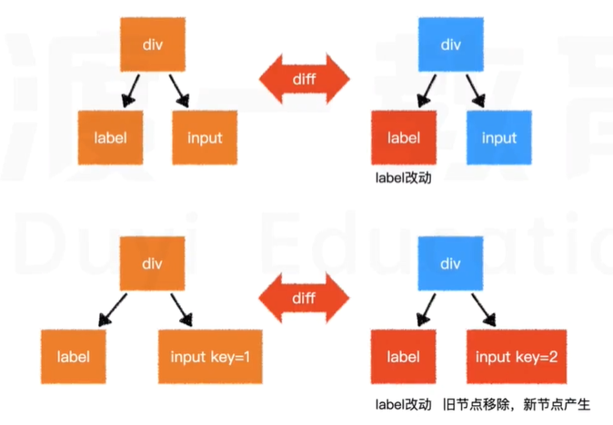

## 模板语法

元素会生成虚拟节点
元素内容部分使用 mustache 语法、元素属性部分使用指令

### 内容

vue 中的元素内容使用 mustache 模板引擎(`{{vm实例}}`)进行解析

> mustache：https://github.com.janl/mustache.js

### 指令

指令(写到元素属性部分)会影响元素的渲染行为，指令始终以`v-`开头

基础指令：

- v-for：循环渲染元素
- v-html：设置元素的 innerHTML，该指令会导致元素的模板内容失效
  `<div id="app" v-html="html"></div>`
- v-on：注册事件
  `<button v-on:click="test()"></button>`
- 该指令由于十分常用，因此提供了简写@`<button @click="test()"></button>`
- 事件支持一些指令修饰符，如 prevent、stop
  `<div id="app"><a href="https://www.baidu.com" @click.prevent="test()">百度</a></div>`
  `<div @click="test3()"><button @click.stop="test2()">点击</button></div>`
- 事件参数会自动传递`@click.prevent="test($event)"`(手动传参)
- v-bind：绑定动态属性(属性的值来自于一些数据)
  `<div id="app"></div>`
- 该指令由于十分常用，因此提供了简写：`<div id="app"></div>`
- v-show：控制元素**可见度**，即控制的是 css 的 display:none; 样式。不会改动元素结构
- v-if、v-else-if、v-else：控制元素**生成**
- v-model：双向数据绑定，常用于表单元素
  - 该指令是 v-on 和 v-bind 的复合版
- 进阶指令：
  - v-slot
  - v-text
  - v-pre
  - v-cloak
  - v-once
  - 自定义属性

### 特殊属性

最重要的特殊属性：key

该属性可以干预 diff 算法，在同一层级，key 值相同的节点会进行对比，key 值不同的节点则不会



在循环生成的节点中，vue 强烈建议给予每个节点唯一且稳定的 key 值


## 计算属性

```js
computes: {
  //仅访问器
  prop(){
      return...
  }
  //访问器+设置器
  fullProp:{
      get(){
          return...
      },
      set(val){
          ...
      }
  }
}
```

计算属性和方法的区别：

- 计算属性可以赋值，但方法不行
- 计算属性会进行缓存，如果依赖不变，则直接使用缓存结果，不会重新计算
- 凡是根据已有数据计算得到的新数据的无参函数，都应该尽量写成计算属性，而不是方法
