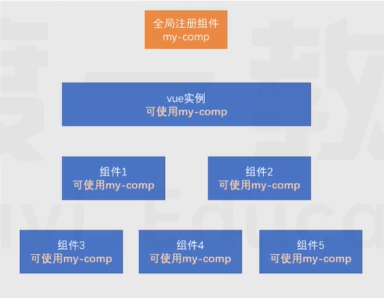
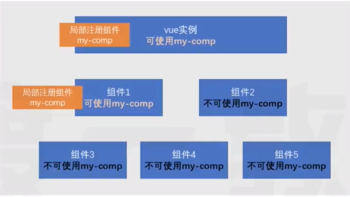
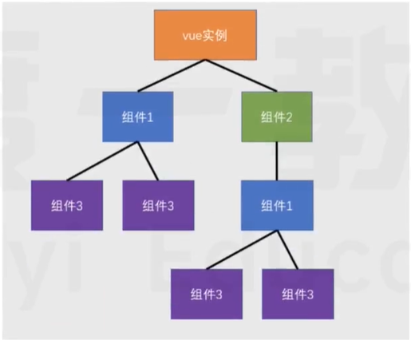

## 知识补充

1. 箭头函数

- 任何可以书写匿名函数的位置均可以书写箭头函数
- 箭头函数将会绑定 this 为函数书写位置(定义位置，即外层函数)的 this 值

2. 模块化

- 没有模块化的世界：全局变量污染、难以管理的依赖
- 常见的模块化标准：！CommonJS、！ES6 Module(官方)、AMD、CMD、UMD

## 组件概念

一个完整的网页是复杂的，如果将其作为一个整体来进行开发，将会遇到下面的困难：

- 代码凌乱臃肿
- 不宜协作
- 难以复用

vue 推荐使用一种更加精细的控制方案————组件化开发

所谓组件化，即把一个页面中区域功能细分，每一个区域成为一个组件，每个组件包含：

- 功能(JS 代码)
- 内容(模板代码)
- 样式(CSS 代码)

> 由于没有构建工具的支撑，CSS 代码暂时无法放到组件中

## 组件开发

### 创建组件

组件是根据一个普通的配置对象创建的，所以要开发一个组件，只需要写一个配置对象即可

该配置对象和 vue 实例的配置是**几乎一样**的

```js
//组件配置对象
var myComp = {
  data() {
    return {
      //...
    };
  },
  computed: {
    //...
  },
  methods: {
    //...
  },
  template: `...`,
};
```

值得注意的是，组件配置对象和 vue 实例有以下几点差异：

- 无 el
- data 必须是一个函数，该函数返回的对象作为数据
- 由于没有 el 配置，组建的虚拟 DOM 树必须定义在 template 或 render 中

### 注册组件

注册组件分为两种方式，一种是**全局注册**，一种是**局部注册**

#### 全局注册

一旦全局注册了一个组件，整个应用中任何地方都可以使用该组件



全局注册的方式是：

```js
//参数1： 组件名称，将来在模板中使用组件时，会使用该名称
//参数2：组件配置对象
//该代码运行后，即可在模板中使用组件
Vue.comonent("my-comp", myComp);
```

在模板中，可以使用组件了

```js
<my-comp>
<!-- 或 -->
<my-comp></my-comp>
```

> 在一些工程化的大型项目中，很多组件都不需要全局使用。比如一个登陆组件，只有在登录的相关页面中使用，如果全局注册，将导致构建工具无法优化打包，**因此，除非组件特别通用，否则不建议使用全局注册**

#### 局部注册

局部注册就是哪里要用到组件，就在哪里注册



局部注册的方式是，在要使用的组件或实例中加入一个配置：

```js
//这是另一个要使用的my-comp的组件
var otherComp = {
  components: {
    //属性名为组件名称，模板中将使用该名称
    //属性值为组件配置对象
    "my-comp": myComp,
  },
  template:
  <div>
  <!-- 该组件的其他内容 -->
  <my-comp></my-comp>
  </div>
};
```

### 应用组件

在模板中使用组件特别简单，把组件名当作 HTML 元素名使用即可

但要注意以下几点：

1. **组件必须有结束**

组件可以自结束，也可以用结束标记结束，但必须要有结束

下面的组件使用时错误的：

`<my-comp>`

2. **组件的命名**

无论你使用哪种方式注册组件，组件的命名需要遵循规范

组件可以使用`kebab-case`短横线命名法，也可以使用 PascalCase 大驼峰命名法

下面两种命名均是可以的

```js
var otherComp = {
  components: {
    "my-comp": myComp, //方式1
    MyComp: myComp, //方式2
  },
};
```

> 实际上，使用小驼峰命名法 camelCase 也是可以识别的，只不过不符合官方要求的规范

使用 PascalCase 方式命名还有一个额外的好处，即可以在模板中使用两种组件名

```js
var otherComp = {
  components: {
    MyComp: myComp,
  },
};
```

模板中：

```js
<!-- 可用 -->
<my-comp/>
<MyComp/>
```

因此，在使用组件时，为了方便，往往使用以下代码：

```js
var MyComp = {
  //组件配置
};
var otherComp = {
  components: {
    MyComp, //ES6速写属性
  },
};
```

> 注意，PascalCase 命名不可以直接在 html 中使用，但可以在 template 配置中使用，想想为什么

## 组件树

一个组件创建好后，往往会在各种地方使用它。它可能多次出现在 vue 实例中，也可能出现在其他组件中。于是就形成了一个组件树



## 向组件传递数据

大部分组件要完成自身的功能，都需要一些额外的信息

比如一个头像组件，需要告诉它头像的地址，这就需要在使用组件时向组件传递数据

传递数据的方式有很多种，最常见的一种是使用**组件属性 component props**

首先在组件中申明可以接收哪些属性：

```js
var MyComp = {
  props: ["p1", "p2", "p3"],
  //和vue实例一样，使用组件时也会创建组建的实例
  //而组件的属性会被提取到组件实例中，因此可以在模板中使用
  template: (
    <div>
      {{ p1 }},{{ p2 }},{{ p3 }}
    </div>
  ),
};
```

在使用组件时，向其传递属性

```js
var OtherComp = {
  components: {
    MyComp,
  },
  data() {
    return{
      a:1,
    }
  },
  template:
  <my-comp:p1="a" :p2="2" p3="3">
};
```

**注意：在组件中，属性是只读的，绝不可以更改，这叫做单向数据流**(谁的数据谁负责)

//img

## 工程结构

见代码
